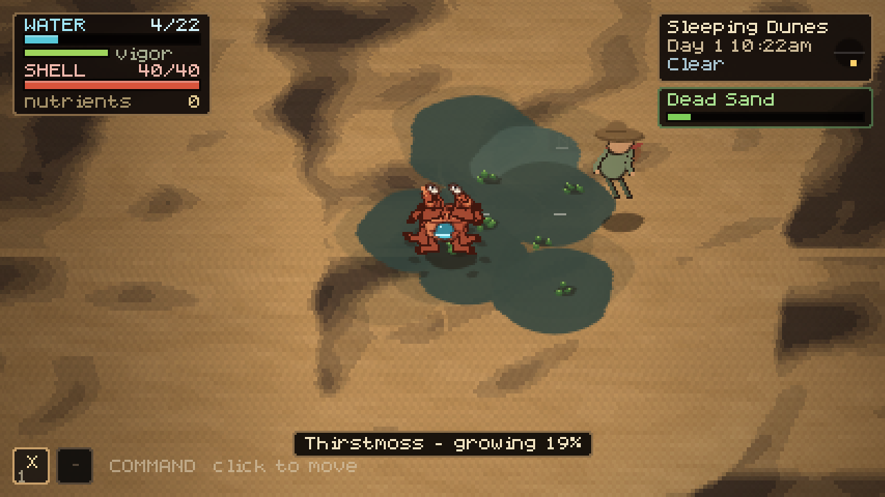
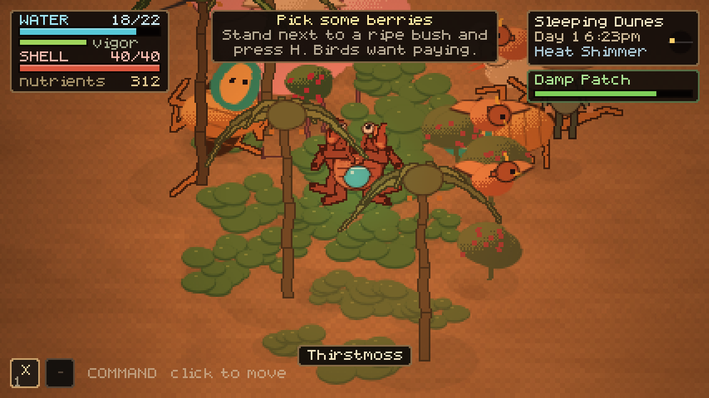
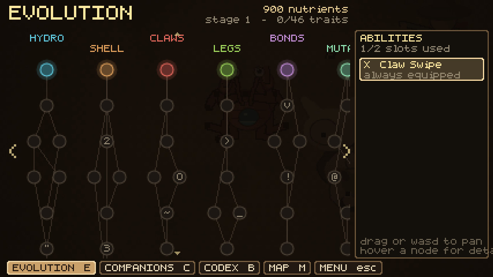
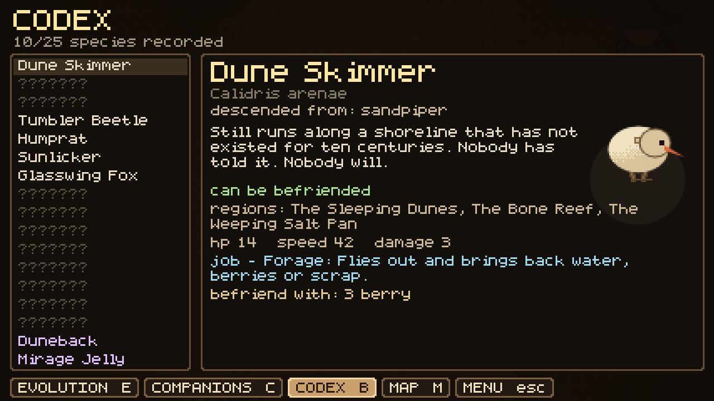
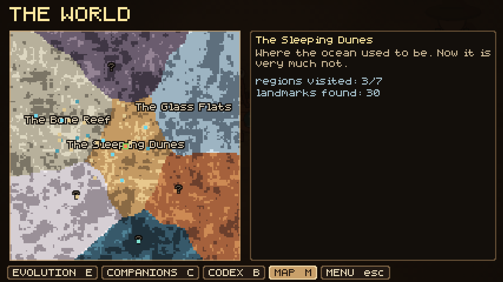

# CRABDEN

You are a crab. You have been asleep for a thousand years. When you wake up,
the ocean is gone, the whole world is desert, and the drop of water that woke
you did not come from the sky.

A 2D pixel-art game about making water, restoring an ecosystem, collecting the
strange things that survived, and finding out where the sea went.



<p align="center">
  
  
  
  
</p>

## Play it

**The quickest way:** open `dist/crabden.html`. It is the whole game in one
self-contained file — no server, no install. Double-click it, or drag it into a
browser tab, or mail it to someone.

**From source**, serve the folder (the game loads as ES modules, so it needs
HTTP rather than `file://`):

```sh
python3 -m http.server 8080   # then open http://localhost:8080
```

**Rebuilding the single file** after changing anything under `js/`:

```sh
npm install   # once; pulls esbuild
npm run build # -> dist/crabden.html
```

There are no asset files anywhere. The terrain, the animals, the plants, the
font and the sound are all generated at runtime, so the source is text.

## Controls

| Input | Does |
| --- | --- |
| **click the crab** | take direct control (WASD to move, left click to strike) |
| **click the ground** | in command mode, send the crab there |
| **click / hold the organ** on its back, or hold **F** | pump water |
| **right click / hold Q** | pour water onto the sand |
| **T** | offer food to a nearby animal and befriend it |
| **H** | harvest ripe berries within reach |
| **R** | absorb water from an oasis or seep you are standing in |
| **space / 1-4** | use equipped abilities |
| **shift** | dash (once you have evolved it) |
| **middle-drag / arrow keys** | pan the camera &nbsp;·&nbsp; **wheel** zoom &nbsp;·&nbsp; **Z** snap back to the crab |
| **E / C / B / M** | evolution tree, companions, codex, map |
| **Esc** | menu (also skips a cutscene) |

## The loop

**Water is the currency.** The organ on your back makes it, slowly, and faster
if you pump — which costs vigor, so you work in bursts.

Pour water on sand and the sand stops being sand. Wet, fertile ground sprouts
the best thing the neighbourhood can currently support, which is how the chain
climbs itself:

```
water -> thirstmoss -> ashberry bush -> birds -> animals -> stiltpalms -> waterwood
```

Plants give **nutrients**. Nutrients buy **evolution**. Evolution makes more
water, a bigger bladder, longer legs, a claw you could open a door with — and
that makes a bigger grove, which brings stranger animals.

Leave your grove alone too long and it dries out and dies. It takes a while,
and a watered plant recovers, but the desert is patient and you are not.

### Creatures

Twenty-five species, each a plausible descendant of something alive today,
1,000 desert years later. Feed one and it stays. Give it a job at the grove and
it works:

- **Dune Skimmer** (sandpiper) — forages: brings back water, berries, scrap
- **Wirefinch** (finch, nests in rebar) — spreads seeds around the grove
- **Humprat** (rat, two humps) — dowses for underground water and opens seeps
- **Sunlicker** (gecko) — guards the oasis, violently, for about four seconds
- **Ashsnail** (garden snail) — leaves a trail of extremely good soil
- **Mirage Jelly** (moon jellyfish that went *up* when the sea evaporated) — calls actual rain
- **The Last Nautilus** — walked out of the ocean on its tentacles and never stopped

…and things that hunt you at night: Husk Scorpions, Rust Hounds, Glass
Crawlers, Salt Wraiths, and one Leviathan.

### Evolution

Forty-six traits across six branches — Hydrology, Carapace, Claws, Locomotion,
Symbiosis, Mutation. Unlocking is permanent, but **active abilities need
slots**, and slots are scarce, so a claw build and a water build play
differently. Moult nodes physically grow the crab: bigger shell, more hit
points, and at one point a fifth pair of legs, which the leg solver simply
picks up and starts walking on.

### The world

Seven regions across a warped, procedurally generated desert, each with its own
palette, hazard, plants and animals:

*The Sleeping Dunes · The Bone Reef · The Glass Flats · The Rustlands · The
Weeping Salt Pan · The Ashwood · The Deep Well*

Oases, seeps, human ruins, whale falls, beached ark ships, water-table
monoliths and one very large hole. Absorb the water, take the surviving
cuttings home, read what the monoliths say about the shoreline moving.

## How it is built

### Procedural animation

The crab has no walk cycle. Each leg picks its own foothold, steps when it has
been left too far behind, and solves two-bone IK against the dune it is
standing on. The body rides a spring on the average of its feet, so it bobs and
tilts across terrain. Claws and eye stalks are springs that lag behind
acceleration, which is where most of the personality comes from. Ground
creatures use a cheaper version of the same system.

### Rendering

Everything is drawn to a low-resolution buffer and upscaled by an integer
factor, so the pixels stay square.

- **scene** — the world, full colour
- **light** — ambient tint for the time of day plus additive lights, multiplied over the scene
- **ui** — HUD and dialogue, blitted last so the heat haze never wobbles text

Terrain is a continuous noise field rasterised into 128px chunks and cached as
two canvases: an albedo pass, and a separate quantised shadow mask. The mask is
drawn back with an offset derived from the sun's angle, so dune shadows stretch
and swing through the day for the cost of one extra `drawImage`.

The heat shimmer is the scene blitted to the display in two-pixel horizontal
bands, each with its own offset — stronger toward the top of the screen, where
the distance is.

### Nothing on disk

- **Font** — a hand-drawn 5×7 bitmap face in `js/lib/font.js`, baked into a tinted atlas
- **Creatures** — body plans (`bird`, `arachnid`, `nautilus`, `leviathan`, …) drawn from parameters, so a new species is a data entry
- **Audio** — every sound synthesised in WebAudio; the score is a slow modal generator that changes key with the mood

## File map

```
index.html            shell
css/style.css
js/main.js             bootstrap + frame loop
js/game.js             systems, frame body, render order, event callbacks
js/lib/
  math.js              seeded RNG, value noise, fbm, easing, colour
  font.js              5x7 bitmap font, atlas, wrapping
  audio.js             procedural SFX + generative score
js/core/
  input.js  camera.js  save.js
js/world/
  regions.js           7 regions, plant tech tree, ecosystem tiers
  world.js             terrain field, chunk rasteriser, landmarks, scenery
  weather.js           day/night, wind, sandstorm, rain, lightning
  ecosystem.js         moisture grid, plant growth, spread, die-off
js/entities/
  crab.js              the crab: IK legs, claws, eye stalks, water organ
  species.js           the bestiary (25 species) and companion jobs
  creature.js          one class, driven by the species table
  npc.js               Dr. Pell
  particles.js         pooled particles, decals, floating text
js/systems/
  evolution.js         46-node tree, stat model, ability slots
  combat.js            damage resolution and active abilities
  spawner.js           ambient wildlife, grove attraction, night raids
  tutorial.js          objectives and story milestones
js/render/
  renderer.js          layers, lighting, heat haze, weather post
  sprites.js           pixel primitives, 2-bone IK, dithering
  creatureart.js       procedural creature body plans
  worldart.js          plants, scenery, landmarks, water
js/ui/
  hud.js  panels.js  cutscene.js  portraits.js
js/cutscenes/script.js the story
build.mjs              inlines everything into dist/crabden.html
```

## Saving

Progress goes to `localStorage` (`crabden.save.v1`) — automatically every other
in-game day, or from the menu. To wipe it: `localStorage.clear()` in the
console, or *Abandon and restart* in the menu.

## Notes

- Tested in Chromium at 60fps from 800×480 up to 1920×1080.
- The camera is free; the crab is a character you command, not a cursor.
- Damage is disabled during cutscenes, on purpose.
- If the crab goes down, something drags it home and the desert takes a cut of
  your nutrients. You do not lose the grove.
