# CRABDEN

You are a crab. You have been asleep for a thousand years. The ocean you fell
asleep in is gone, the seabed above you is now a desert, and the thing that
woke you was an archaeologist relieving herself on what she took to be a rock.

There is a spring in your back. There used to be a sea here because of it.

**CRABDEN** is a side-scrolling pixel-art ecosystem tycoon. Water is currency.
You pump it out of the organ in your shell, spend it on seeds, and grow the
plants *on your own back*. Plants fix nutrients and express genes; genes are
the only thing that unlocks evolution; the garden you are carrying decides
which of the desert's thousand-year descendants walk out of the dunes to live
on you. Some of them join your fleet. Some of them come up out of the sand at
night with their mouths open.


---

## Play it

**Single file, no install, no server.** Open `dist/crabden.html` in any
browser — including straight off the filesystem.

```
git clone https://github.com/PukkingDragon123/solid-fishstick
open solid-fishstick/dist/crabden.html
```

To run from source, or to rebuild the bundle after a change:

```
npm install       # esbuild only, used for the bundle
npm start         # http://localhost:8080
npm run build     # -> dist/crabden.html + dist/crabden.body.html
```

## Controls

|  | keyboard | touch |
| --- | --- | --- |
| scuttle | `A` / `D` or arrows | left thumbstick (drag anywhere in the lower-left) |
| dig in (opening only) | `E` | **DIG IN** |
| the spring | tap `Space` in time with the gauge | tap the valve in time with the gauge |
| pick what is ripe | `R` | **PICK**, or tap the bead over a plant |
| build on your own back | click yourself | tap yourself |
| put a parasite on something | `X` | — |
| put a relic in your basin | `K` | — |
| tap out a word | hold/release `T` | — |
| sit down with her | `C`, or click her | tap her |
| Vess: follow, get on, get off | `F` | — |
| act — dig, win over, strike | `E` | **ACT** |
| map / fleet / field notes | `1` / `2` / `3` | **SHOP**, then a tab |
| inside you | `G` | tap the orb |
| control mode | `M` | **MODE** |
| zoom / pan | wheel, drag (locked while you are on your own back) | pinch, drag (same) |
| switch mode | `M`, or click one of the five chips | the same chips |
| the claw (HUNT) | `Q`, on the band | **STRIKE** |
| an ability (HUNT) | click its slot | the same |
| the spore (SPORE) | hold `V`, release at pressure | hold the button |
| take one of yours (HIVE) | click it, or its token | the same |
| where to walk (ROAM) | click anywhere in the desert | the same |
| sing back (taming) | `1`-`5` | the pitch keys |
| the menu | it is where you start | the same |
| lure her in | `L` | — |
| spray the spore | `V` (again to let her go) | — |
| her pick, once she is yours | `E` | — |
| her bench | `B` | **SHOP**, then BENCH |
| pause / back out | `Esc`, or the chip in the top-right corner | the same chip |

The chip in the corner is the only button that is always in the same place. It
is a **back arrow** while you are inside something and a **pause** while you are
not, and pausing stops the world and gives you sound, a fresh run, and the way
out.

A crab does not turn round to walk — but it does turn round. Reverse direction
and the animal **pivots**: it goes edge-on, comes back out the other way, and
carries on sideways with the other shoulder leading. Everything on its back
turns with it.

The game autosaves every twenty seconds and reloads where you left off.

---

## The opening

The game does not start in the desert, and it does not start with a film. It
starts thirty metres under water, **and you can walk around in it**.

There is no separate ocean renderer. The reef is the desert: the same terrain,
the same camera, the same crab, with a sea put on top of it by
`js/systems/sea.js`. Every dune you will later cross is a sandbank down there,
and every ridge is a ridge. That is the whole point of the prologue — you are
looking at the ground you are going to spend the game on, one thousand years
before it dried.

The sea does three jobs. **The column**: everything above the seabed is water,
so the desert sky and the far dunes are painted out of the frame entirely,
before anything in the water is drawn — because the reef and the animal are
*in* it, not behind it, which is the difference between a sea and a blue
filter. Light comes down through it in shafts that lean and sway, caustics
crawl over the sand, silt hangs in between, and if you are shallow enough the
surface is up there being bright.

**The life**: corals placed on the terrain the same deterministic way the dig
sites are, and painted the same way as everything else — staghorn, sea fans
with cross-ties between the ribs, brain coral with real grooves, tube sponges,
anemones, soft weed. Urchins, starfish and shells on the sand, crablets walking
about on it, shoals of fish whose tails beat about the peduncle while the body
leans into the turn, jellyfish pulsing upward, and bubbles coming up out of the
seabed and off you as you walk. Anything big enough to hide you is drawn
behind you.

And **you are hand-sized**. The coral towers over you. That is how you know.

When you have found a hollow you like, you **dig in** — `E`, or the DIG IN
button — and from there the opening is **shot, not just played**.

It is cut into acts, and the camera is a camera. The dig is a **push in**, tight
on the animal working itself under in a burst of silt. Then the sea starts to
leave and the camera **pulls wide** and drifts, so you watch it go from the whole
basin rather than from on top of the animal: the surface walks down the world,
the reef thins out, the blue comes out of the light, and a counter runs to 1,000
on a slate held high in the frame.

Then it **cuts to black**. A thousand years does not get a dissolve. The card
comes up — ONE THOUSAND YEARS, *and nothing at all happens* — a rule draws
itself out under it, and the black lifts onto a **montage**: four held frames of
the same mound, hard-cut between rather than faded, each one a different hour, a
different angle and a little further into the desert, every one of them creeping
so a held shot is still a shot and not a paused game.

Black again, and then the widest frame in the game: an empty basin at nine in the
morning with **one person walking across it who is far too small for it**. The
camera holds, drifts in, and only then cuts to the shell. Every beat under it is
a framed shot with its own drift, the frame carries a vignette and letterbox bars
throughout, and the eruption **snaps wide** to give a thousand years of sand
somewhere to go.

You are still under it with only your shell showing, and a woman who has been
wrong about a rock for eleven years sits down next to you.

| | |
| --- | --- |
|  |  |
| 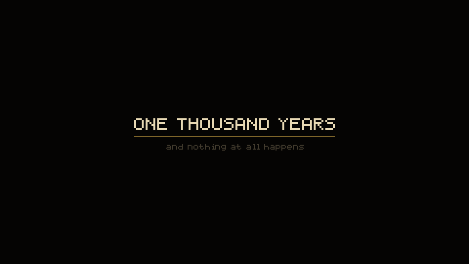 | 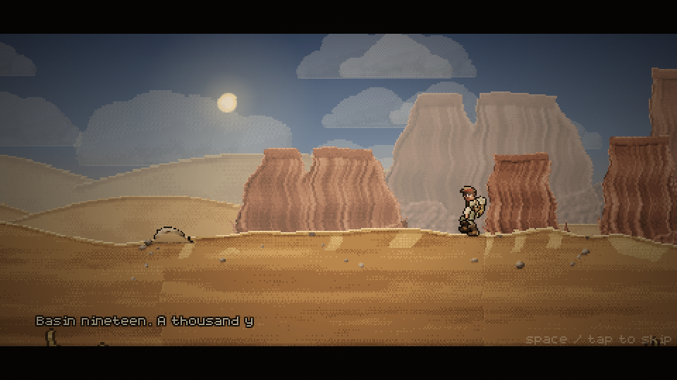 |


---

## The loop

**Water → plants → genes → evolution → more water — and the whole time, keep
walking, because the only thing out here worth having is over the next dune.**

1. **Pump.** The spring is a muscle with a rhythm, not a key you hold. A needle
   sweeps a bore and a band marks where the chamber is actually full: tap on
   the band and the stroke lands, tap on the middle of it and it lands
   perfectly, tap anywhere else and you have wasted a stroke. Land them in a
   row and the spring runs harder — and the band narrows, the needle speeds up,
   and past six in a row it **stutters**, reversing without warning, because
   the better you get the less margin you are given. Hammering does not work:
   a chamber has to refill between strokes, and a second push too soon breaks
   the chain. Water goes into the tank, then into the stone basin behind your
   crest, and when neither can take any more it comes over the lip and down your
   shell as a waterfall onto the sand you are standing on.
2. **Plant.** Click yourself to climb onto your own back, then **drag a seed
   out of the rail and drop it on a bed**. It goes in as a seed and does
   nothing at all until it has taken up water — the ring round it fills as the
   basin soaks it, and then it germinates. Seeds go anywhere on the shell;
   there is no slot count. What limits you is **balance**: everything you carry
   has a weight, you can only carry so much, and it matters which side you put
   it on. Overloaded, everything grows slower and you walk slower. Badly
   trimmed, you walk with a list and the heavy side starts to suffer.
3. **Pick.** Nothing on your back pays out on its own. A mature plant **ripens**
   on its own clock — and several of them will not ripen at all unless a
   condition holds: at dusk, after dark, in daylight, in the shade of something
   taller, with water in the basin, with something living on you. When it is
   ready a bead appears over it. Take it and it pays. A mature plant also
   expresses a **gene**, and genes are not purchasable: the only way to hold one
   is to be carrying something alive that expresses it.
4. **Attract.** Every species scores your shell — which genes it expresses,
   how lush it is, whether there is standing water — and only makes the walk
   when the score is worth it. Get close, offer fruit and water, and it joins
   your fleet and starts working.
5. **Evolve.** Evolutions cost nutrients *and* a specific set of genes. Growing
   from juvenile to adult to ancient makes the shell bigger, the basin deeper,
   and the garden on your back larger in every sense.

**Nobody explains this in a wall of text.** Dr. Vess teaches it, one line at a
time, in her speech bubble, and only when you are actually standing in front of
the thing: the spring the first time you look at it, your own back the first
time you have water to spend, the bed the first time you are up there, the
germination the first time a seed drinks, the bead the first time something
ripens, and the shape of the whole loop the first time you pick. Each beat fires
once, and growing is something you can watch happen — the husk splits on a ring
of light, every stage up **springs** the plant with an overshoot that settles,
and a mature one goes off with a ring and its name.

### The front door

There is a title screen, and it is the game rather than a picture of a logo:
**your own crab**, out of your own save, standing in a sandstorm — and Dr. Vess
beside it, **drinking a beer**. She takes a pull every couple of seconds, the
bottle empties as she does, she looks at the empty one for a moment, and then
she throws it — a real bottle on a real arc that spins, bounces once and lies in
the sand until the desert takes it back. Then she opens another, because there
is nothing else to do out here and there has not been for eleven years.

The storm behind it is real weather with the wind turned up, blowing in gusts so
the title is never evenly lit, with lit grit blowing past over the top of it and
the selected plate breathing where your hand is. There are two words on it:
**START**, which carries on from your save if you have one and wakes you out of
the sand if you do not, and **SETTINGS** — sound, touch controls, and **erase
everything**, which asks you twice and means it. Nothing on it explains itself,
and the only other thing written there is whose desert this is.

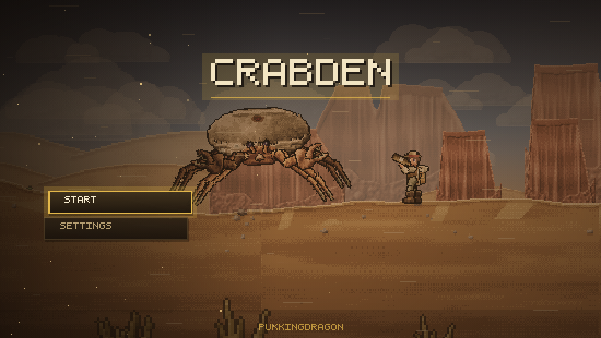

### Five things you can be doing

The bottom-left corner is a column of five badges, and each one is **a picture
of the thing, painted pixel by pixel** rather than a symbol standing in for it:
the animal standing square on, the same animal mid-stride with its legs gathered
one way, a claw about to close, a spray head with what comes out of it, and a
nerve with everything strung off it. The one you are in sits proud of the
others like a pressed key, lit in its own colour with a bar down its edge and a
wash of that colour behind the art.

**And it shows on the animal, not only in the corner.** The crab's own eyes take
the mode's colour and burn a little at the back of them — red in hunt, violet in
spore, cold blue in the hive, green in roam — so you can tell what you are
holding by looking at the thing you are holding it with. Beside the column is
whatever that mode actually puts in your hand, and it changes completely
between them.

**WALK** steers. **ROAM** does not wander: click anywhere in the desert and a
pin goes in the sand and it walks itself there and stops. It will never pick
its own destination — an animal that wanders off while you are reading a panel
is an animal you then have to go and find.

**HUNT** brings up the strike gauge. A needle sweeps, a band on it is where the
claw is actually closing on the thing, and a much narrower core inside that band
is where it lands on the joint. Band is damage; core is a great deal of damage,
a stagger, and a knockback. Land them in a row and the multiplier climbs — and
the window narrows and the sweep speeds up, because of course it does. Miss and
the claw is out and open and you are the one standing there with your chest
exposed for the best part of a second. Beside the gauge sit the abilities your
genome has actually grown: **Thorn Hide**, **Bulwark**, **Strike Reflex** (the
next swing cannot miss), **Apex Nerve**, **Lumen Organ** (everything looking at
you flinches), **Signal Skin**.

**SPORE** is a throw. Hold to build pressure and the arc goes further out; let
go inside the band and the cloud lands where the arc said. Let go early and it
falls short. Hold too long and it goes off on the animal holding it.

And the corner stops being a spring. In spore mode the **water shell becomes the
gland** — a sac of violet fluid slung under a ring of chitin, with things moving
about in it, swelling as the pressure rises — and the **valve becomes a nozzle**,
which is a ring of muscle with a spout through it that clenches as you squeeze
rather than opening like the valve does. What it throws is not water and does not
behave like water: the motes hang, drift upward and wander off, and the gauge
beside it has a band that throws and a red end where it bursts. The mode bar
beside it stops repeating the charge and tells you the thing you actually need —
who is in range, and whether the spore would take in them, with the three ways in
(hurt it, feed it, or earn it) shown as chips that fill in.

**HIVE** is everything on your nerve, and the nerve itself.

### The frame takes the colour of your hand

What you are holding is not a chip in a corner — **it grades the whole world**.

**HUNT** drops the frame into a hot red: the sand goes bloody rather than brown,
the edges close in hard, two bars of heat breathe along the top and bottom on the
strike beat, a scanline crawls, and every landed hit kicks a bright pulse through
the lot of it. Some rows of the picture jolt out of line as it goes, so the whole
screen flinches.

**SPORE** goes the other way: violet, lifted rather than darkened, with the
frame breathing closed slowly and spores hanging in the air drifting up across
everything. And the world **warps** — long, slow, low waves that run down the
picture out of phase with each other, so nothing you are looking at is quite
still. Both are built out of the same square pixels as the rest of the game.

| | |
| --- | --- |
| 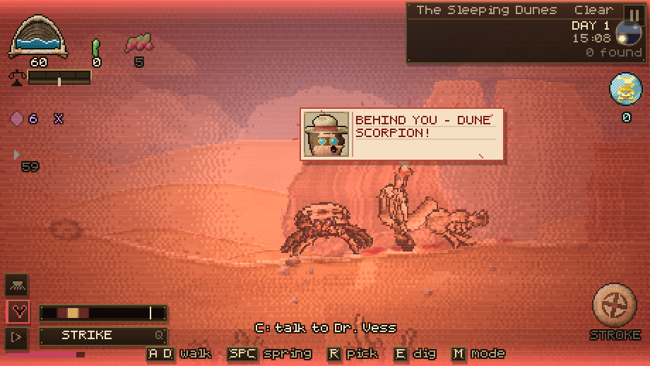 | 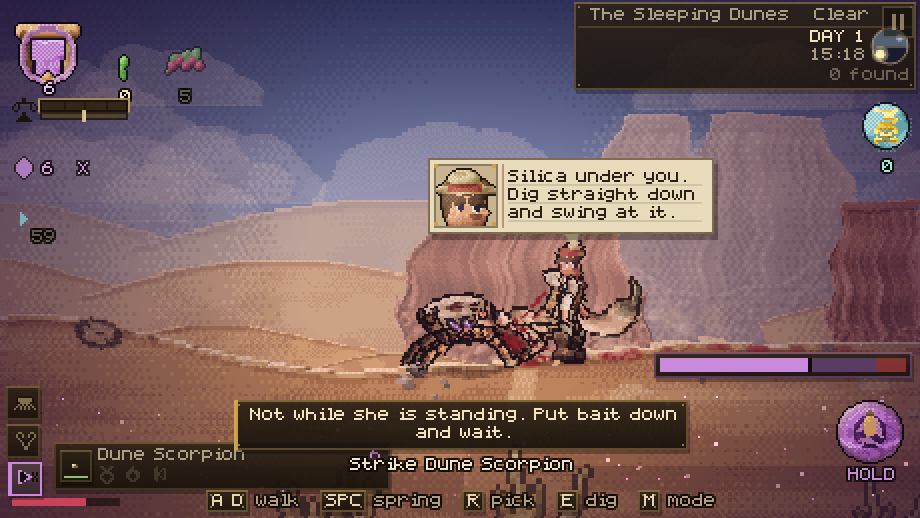 |

| | |
| --- | --- |
| 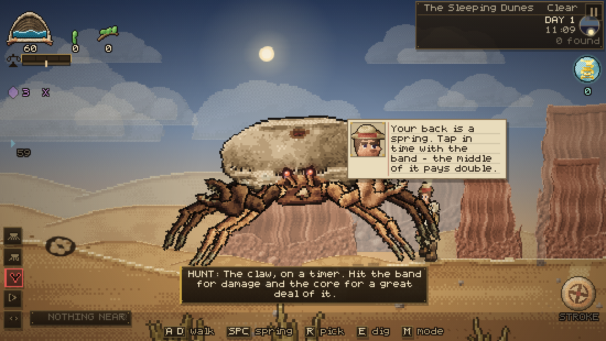 | 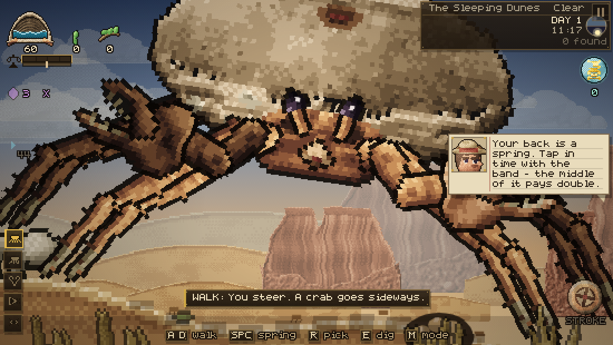 |

### What is yours

The third readout in the corner used to be a count of fruit, which told you
nothing you could act on. It is **the animals themselves** now: each one drawn
as its own head, on its own plate, with the thread of what is left of it
underneath and a breathing frame round whichever one you are currently riding.
Click one and you are it. Until you have any, the slot shows the sprig instead —
because fruit is how you get the first one, and the slot should say what fills it.

### The small print of the desert

Under the bestiary — under everything big enough to matter to you — there is a
layer you are not supposed to notice until you stop and look, and then cannot
stop noticing. **Twelve small animals**, none of which can be tamed, fought,
eaten or collected. They are not content. They are the reason a frame with
nothing happening in it is still worth looking at.

Each is its own animal rather than a recolour: its own silhouette drawn by hand
at eight or ten pixels, its own way of moving, its own hours, and its own opinion
about wind. **Skitterlings** run in bursts and stop dead, never in the middle of
anything. A **glass mite** is so transparent you see its shadow before you see
it. **Salt fleas** jump their own length forty times a minute. A **dust moth**
flies badly on purpose, because nothing that eats it can predict it either.
**Piper gnats** stand in a column over one spot all morning. An **ash tick**
holds absolutely still on a stone until something warm goes past. A **lantern
fly** is cold green and goes out the moment you look at it. A **bone burrower**
surfaces, turns its head once, and is gone before you are sure. And a **sand
shrimp** has had a thousand years and still has not accepted that the sea has
gone.

They live in deterministic colonies, so the same stretch of desert has the same
small life in it every time you walk back down it — and a sandstorm drives the
lot of them into the ground.

### The dream

While you are in the hive the world goes over. The whole frame grades cold and
a little bit wrong, slow bands of light cross it out of step with each other so
nothing in the picture sits still, three pulses travel out from your shell along
the nerve, and every animal on that nerve is haloed and strung back to you by a
thread with a bead of signal running down it. The frame breathes closed at the
edges. Your roster is a row of tokens along the bottom with a thread of health
under each; click one and you are it, and A / D walks it.

### A song, not a purchase

**You do not buy an animal.** There is nothing to buy one with and nothing out
here that wants what you have.

What you do is put out the thing its species actually crosses a desert for, and
it is different for every clade: **berries for the birds**, **standing water for
the reptiles**, **a flower in bloom for the insects**, **shade for the small
nocturnal things**. All four are things already on your back, so baiting a bird
means growing what a bird wants. A ring fills on the animal as it decides about
you, and when it is full a note bobs over its head, and it sticks to you.

Then you have to talk to it, and neither of you has words — so you do what two
animals without words have always done. **It gives you a phrase and you give it
back.** The phrase is a row of blocks whose heights are the pitches; it sings
them at you, and then you sing them back on the number keys, on the beat. Four
phrases, getting longer and faster. Fumble one and you lose ground but not the
animal. Get most of them and it joins you — and a bird's range is wider than a
lizard's, which is most of why a bird is harder.

A spore is the other way in, and that has a condition of its own: **it only
takes in something willing**. Worn down, fed, or already half trusting you. An
animal that is none of those throws it off, and remembers that you tried.

| | |
| --- | --- |
| 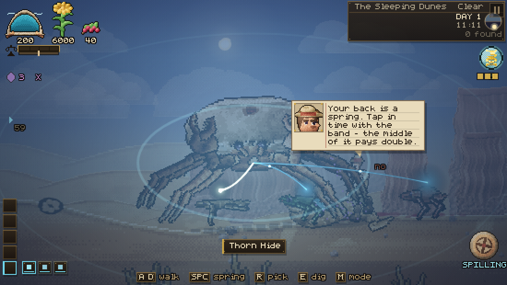 | 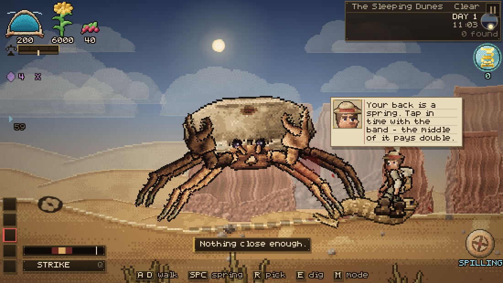 |
| 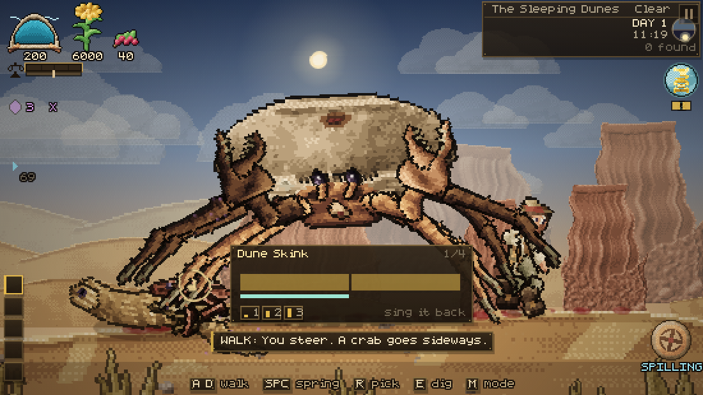 | 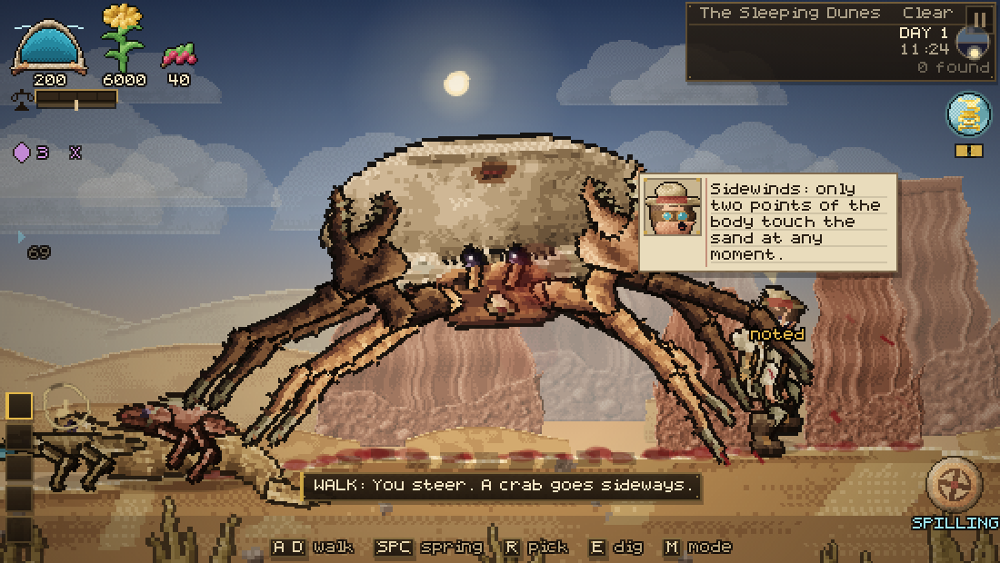 |

### Hands

**You have claws the size of a door and no thumbs.** That is the whole problem,
and there is exactly one solution to it walking around the basin.

It takes three steps, on purpose, so none of it happens by accident. **Lure**:
put an artefact on the ground in front of you — she has been wrong about a rock
for eleven years and she cannot walk past one — and she comes over and crouches
down over it, which is the only time her head is low enough and still enough to
reach. **Spray**: a spore, at close range, while she is down. There is a beat
where she knows. **And then her eye goes blue and stays blue**, and she stops
talking, because there is nothing left in there doing the talking.

While you have her she does what you point her at and nothing else. She walks
on your keys. She swings a pick. She works the bench. Press `V` again and you
let her go, and she comes round a hundred metres away having lost an hour, and
says so.

### Mining

Under the basin are **seams**, and they are deterministic — the same seed puts
the same copper in the same place for ever. Shell hash near the top, salt sheets
under it, then silica, then the copper that was dissolved in the sea when it
dried, then amber, and at the bottom iron, where the water was deepest and
stayed longest. A seam you have not reached yet shows as a **glint in the
ground** that brightens as your hole gets near it, so the desert tells you where
to dig instead of making you guess.

Every swing takes a bite out of the ground whether or not there is anything
under it, so getting down to a deep seam is the work. Once a seam is open it
takes hits, cracks a little more with each one, and then breaks.

The ladder closes, so nothing needs a pick made out of itself: **her trowel gets
everything down to copper**, copper buys the **copper pick**, and the copper pick
is what opens **iron and amber**. The iron pick is not a gate — it is just
faster, and it drops an extra lump.

### Crafting, and a base on your back

The bag is hers, because she is the one with hands. The tree is three tiers and
it runs **through the garden**: ore melts into bar at the **kiln**, bar becomes
part at the **bench**, part becomes the thing that goes on your back — and the
kiln and the bench are both things you build on your own shell. So the loop is:
mine, refine on the animal, build on the animal, mine deeper.

Grit and salt press into **bricks** by hand; shell winds into **spool**. Copper
and iron go to **bars** at the kiln, silica and salt to **glass**. At the bench:
**gears** out of copper, **pipe** out of iron, **pane** out of glass, and then
the two picks and the **spore sprayer** that made all of it possible in the
first place. Every card in the panel shows what it needs as icons, greyed with a
reason when she cannot make it yet.

| | |
| --- | --- |
| 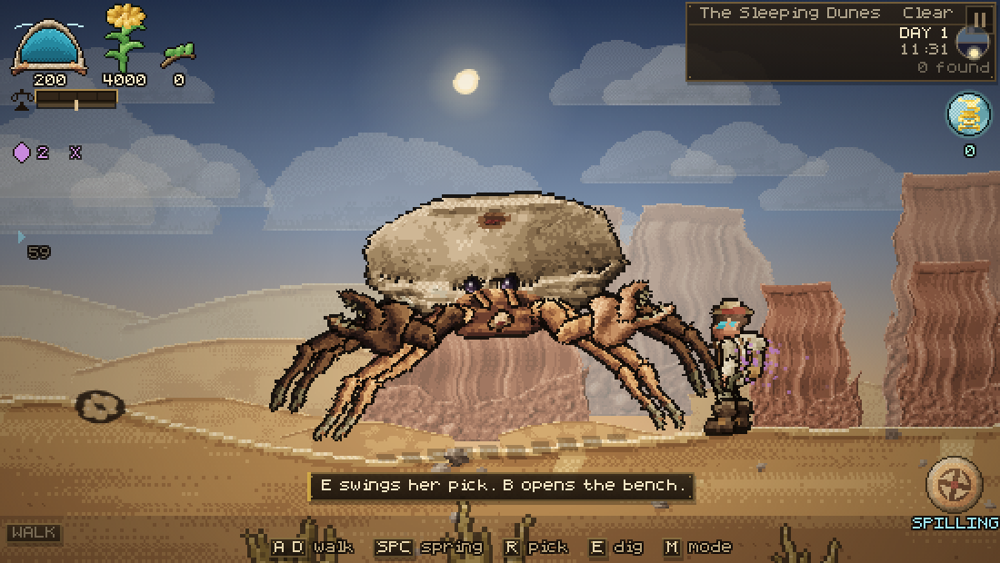 | 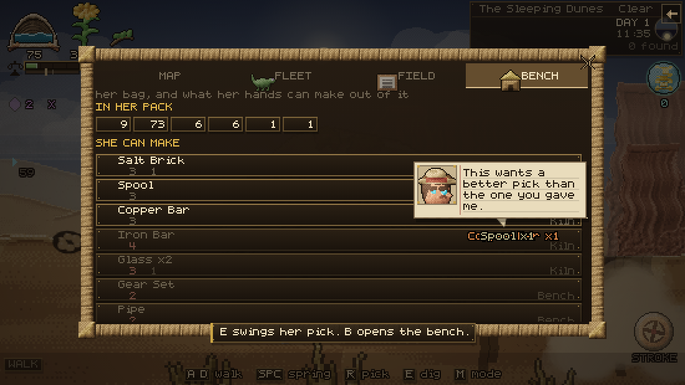 |

### Your genome

There is no skill menu. There is the animal, and you can look into it.

Press `G`, or tap the orb on your own back, and the camera does not stop at the
shell — it **dives**. You rush up at yourself out of the dark, a speck growing
into an animal filling the screen; then through the rock, the chitin and the
pearl, each layer named as it passes, the stars stretching into streaks, and out
the other side into the cavity where the thing that decides what you become is
sitting.

It is a skill tree, and it is built to the rules that make skill trees
readable rather than impressive:

- **Six arms, evenly spaced**, so a direction always means the same system and
  you learn where things are by where they are: FORM straight up, then SPRING,
  SHELL, BROOD, PINCER and LEGS around the clock.
- **Growth runs outward from a seed**, so how far a thing is from the middle is
  exactly how deep into that system you have gone. Each arm forks once and
  comes back together at a keystone, which is drawn bigger and ringed.
- **Nothing is drawn that you cannot reach.** You see what you own and what is
  one step past it, joined by a dashed lead, and a short stub where a chain
  continues. A wall of grey nodes you cannot buy teaches you nothing and makes
  the ones you can buy harder to find.
- **State is readable without reading.** Owned is lit and filled, closed by a
  ring with three lights running round it; affordable pulses; unaffordable
  carries an arc showing how much of its price you have saved so far. Rings at
  each tier and a filling bar beside every arm's name say how deep you are
  without you counting beads.
- **Every node carries a picture of what it does** — a drop, a moon, a saw, a
  spade, a crown — and exactly one effect that nothing else has. Words are for
  the hover card, which tells you what it is, what it costs, and precisely what
  is in the way if you cannot have it.
- **Buying one is an event**: the bead lights, sap runs out from the seed along
  every link it took to get there, two rings open out of the node with sparks
  thrown off them, the screen flares, and the organ at the end of that arm
  visibly grows.

Around the outside is the animal itself. Not a drawing of one: the crab. The
genome screen takes the very rig the desert crab is assembled from, poses it
standing and bakes it (`js/art/crabpose.js`) — the same carapace, the same eight
legs solved through the same IK, both claws, the eyestalks — then fills the
shape dark, lights its outline, and lays the full-colour render back inside it
as an x-ray, so the silhouette you grow your genome inside is the silhouette you
walk around in, joint for joint. It grows as you grow: a hatchling is a coin
with legs here too, and one sprite pixel is never blown up past a fixed size, so
evolving is visible on this screen as well as out in the sand. The basin on its
back holds however much water is actually in it.

Behind all of it is a galaxy, painted once from a bulge, two logarithmic arms
scattered star by star with pink nurseries strung along them and dust lanes
eating their inside edges, then turned very slowly while four layers of near
stars slide across it. Round the seed is a ring of **genes**, which are the one
thing you cannot buy: they light up only while something alive on your back is
expressing them.


### Three ways to move

**WALK** — you steer. **ROAM** — the crab walks itself toward whatever is over
the next dune, and you watch. **FLEET** — click one of your own and click where
to send it. The last two unlock in the tree.

### Build mode

There is no shop and there is no build button. **Click the animal** and the
camera comes in on the shell, the seeds come out down the side, and you are up
on your own back — which is where planting something on your own back ought to
happen. **Nothing moves while you are up there.** Not you: it is your shell,
you are standing on it, and the legs are not available. Not the view either —
the camera is nailed to the shell, so a drag is a drag on a plant and a pinch
is not a way to lose the thing you were placing. The spring is shut too; you
are not running anything from up there.

The rail shows what you can carry, what you are carrying, and a grid of seeds
and structures. Pick one and the card at the bottom says what it costs, **what
it pays and how often**, what condition it needs before it will ripen, and what
it weighs. Press place, and every legal bed on the shell pulses, a ghost
follows the nearest one, and a bracket marks where it lands.


### Your fleet, and the parasites

Everything living on you has a card in the **FLEET** panel: what it is, what it
does, how far off it has wandered. Click one and the camera goes to it and the
movement keys become *its* movement keys, until you let go.

Some of them did not volunteer. A **mindcap** fruits parasites instead of food —
things that are almost animals, which hatch looking for a nervous system and
find yours already occupied. Press `X` next to a wild animal and one goes in.
What it takes over, you steer, and a hostile thing stops being hostile the
moment one of your children is in its nerves.

Dr. Vess has opinions about this.

> You just put one of your own children inside a lizard. I am writing that down
> and then I am going to think about it for a long time.

### Bringing it back

The basin was a sea, and you were the reason it was a sea. So the most
interesting thing you can do with water is not drink it — it is **spill it**.

Water coming off your shell soaks into the ground and stays there. Keep a
stretch wet long enough and things come up in it on their own, and stay up, and
hold their own water after that. Walk far enough with the valve open and the
strip behind you is a different colour from the strip in front of you. Vess
notices.

> That is a plant. Nobody planted that.

An **oasis** is just this taken to its conclusion: ground that holds itself
green without you, with reeds standing in the water, ferns and berry on the
banks, and animals that only live where there is standing water.

### What is under the sand

Everything that ever lived here is still here, a metre down. Grow a **digging
claw** and fossil and amber start showing above the sand — a corner of shale, a
bead of amber catching the light from a long way off. Dig one up and it goes in
your pack, and the ground it came out of goes everywhere: a low ring of smoke
spreading outward along the sand, a column of it going up the middle, and a
spray of actual grains thrown clear that bounce once and settle. Everything
that digs in this game uses it — you, Vess over her trench, and the animal
burying itself in the opening, where the same burst is silt instead of dust and
drifts instead of settling.

Then put it in the pool on your own back (`K`) and keep the water up. Given
long enough in standing water, a thousand-year-old thing in a rock **hatches**,
and walks off your shell into a desert that has forgotten it.

> You are going to put a fossil in a puddle on your back and wait. And it is
> going to work, is it? It is, isn't it.

### Living and dying

Everything out here ages. Animals get old and die of it, and your own fleet
turns over — which is the point of **Brooding**, which lets what lives on you
breed on you and replace its own dead. When something of yours dies, Vess says
something about it, and the ground it lies in is richer tomorrow.

The clock in the corner is a real dial: the sun and the moon go round it, the
lit half of the day is light and the dark half is dark, and it counts the days.
Things come up out of the sand at night.

### The map

One long strip of the basin, because the world is one long strip of the basin:
the real terrain profile under a band of the country you are crossing, distance
ticks in metres from where you woke, and every landmark within reach — oases,
human ruins, bonefields, wind-cut spires, and the occasional hull sitting
kilometres from any sea. Somewhere you have not stood is a `?`.


---

## What is out there

Seven biomes run for forty thousand strides: the Weeping Salt Pan, the Bone
Reef, the Sleeping Dunes, the Glass Flats, the Rustlands, the Ashwood and the
Deep Well. Each has its own sky, ground, rock and residents.

**Landmarks** are the point of walking. They are generated from the world seed
and sunk into the terrain itself, so an oasis is a real bowl you walk down into
with water standing in it, not a decal — and it is exactly where you left it
tomorrow. Oases, ruined shore towns, bone fields where a herd died on the way
somewhere better, and wind-cut spires. Each one has a name, and a chevron at
the edge of the screen points at the nearest one you have not stood in.


Smaller finds sit between them: buried relics, wild seed patches, water seeps,
old kills, nests — and disturbed sand, which is not a find so much as a warning
you probably will not read in time.

### The bestiary

Nearly everything alive here is a reptile or an arthropod, because those are
what a drying world leaves: a waterproof skin and a way of excreting waste
without spending water on it. Nine reptiles, nine bugs and arachnids, four
furred survivors that never drink, three birds.

You do not read their entries. You **watch** them, and Dr. Vess writes them
down — five field notes per species, unlocked by observation, spoken aloud as
she works them out. Real behaviour: the skink dives into a dune rather than
running across it, the pebbler's spines comb dew into its own mouth, the digger
wasp restarts its entire sequence if you move the prey a few centimetres.

And they are **her** notes, in her notebook, in her hands. If she is not with
you, the field-notes tab tells you how far away she is and which way. That is
the point of keeping her: `F` calls her over, and once you are big enough to
take her weight she rides the near rim of your shell and writes while you walk.

Hostiles do not bother a bare rock. Once you are carrying something worth
taking they start arriving, faster at night: dune scorpions in pairs, a bone
centipede with twenty-two pairs of legs all going the same way, a pale serpent
that is already where you are going, and a stone basilisk that is not hunting
you — it is checking whether you are new.


### What actually happened here

This was a shallow shelf sea. It did not dry up because of a catastrophe. It
dried up because the artesian system that filled it ran through the body of one
very large animal, and that animal went to sleep. Eleven shore towns cut their
cisterns facing the water, moved twice, and stopped. The lore is found rather
than given: fragments come off ruins one at a time, and Vess assembles the rest
as you find places.

---

## How it is built

No engine, no framework, no dependencies at runtime, and **no asset files at
all**. Every pixel in the game is generated in the browser when it starts.

### The painter

`js/render/pixel.js` is the reason the art looks the way it does. Sprites are
not drawn with strokes and fills — each one is built as a set of fields
(coverage, height, material, tint) and then *shaded*:

- surface normals come from the gradient of the height field
- lighting is lambert + rim + a cavity term (local height minus blurred height)
  + specular + subsurface translucency for leaves and membranes
- the result is quantised onto a per-material eight-colour ramp with 8×8 Bayer
  ordered dithering, then given a dark outline

`js/lib/palette.js` holds about forty materials — chitin, shell rock, claw,
leaf, moss, petal, berry, sand, bone, rust, water, fur, feather, scale,
carapace, membrane, horn, rope, cloth, metal, glass, skin, khaki, leather — so
a fern frond and a crab's leg are lit by the same sun and sit in the same
desert. Everything is baked once into a canvas at load.

### No smooth circles anywhere

The one thing that kept escaping the grid was circles. A glow round an eye, the
sun in the sky, a ring off a splash, the shadow under an animal — all of those
went through the canvas arc / ellipse / radial-gradient path, which is smooth,
anti-aliased and continuous, and beside a dithered sprite it reads as a sticker
somebody stuck on the screen.

So `js/render/pix.js` draws every round thing out of squares, on the same grid
the sprites are on, with the **same ordered dither** on the soft edges instead
of an alpha ramp: `pxDisc`, `pxEllipse`, `pxRing`, `pxArc`, `pxGlow`, `pxBlob`,
`pxLine`, `pxCurve`, `pxVignette`. A pixel here is `p` screen pixels, so passing
the camera zoom snaps a disc in the world to the world's own grid — which is
what stops it crawling when the camera moves. A glow is three or four flat
bands dithered into each other, never a gradient.

The sun and the moon are the biggest round things on the screen and were the
two that needed it most; the moon has a bite of dark side and two seas now
rather than a translucent overlay. Every eye glow, spore cloud, dust puff, gore
blob, splash ring, trust dial, progress arc, ore bed, shadow and half-buried
fossil went the same way. The full-screen grades are the same — a canvas
gradient would be the one smooth thing left on the screen — and they are baked
into a cached canvas once per size rather than rebuilt out of forty thousand
fill calls every frame.

### The crab

The crab is drawn **head-on**, because that is how a crab moves: it does not
turn to walk, it faces you and goes sideways underneath itself. The camera sits
a little above the animal, so the top of the shell is a real foreshortened
surface rather than a silhouette. `shellSurface(a, b)` in `js/art/crabart.js`
is the single source of truth for that surface — the art is painted from it and
the garden is planted on it, so a plant can never float off the rock.

The carapace is stamped as a height field over that surface and the shell wall
is then hung off the lowest pixel of each column of the result, which is what
makes the whole thing read as one solid animal instead of a rock with legs.
On it: horizontal bedding like the mesas it slept among, eroded shelves,
fracture lines, desert varnish streaking down the flank, crest spikes, fossil
barnacles, and a real stone basin behind the crest for the spring to fill.
The face is a chitin plate set into the front wall with two shallow orbits in
it, and the eyes are small hard black beads on short stalks with one live
specular dot — crabs do not have big expressive eyes, and pretending otherwise
makes them look like a toy.

You start as a **hatchling**: a coin with legs, about a quarter the width of
the adult, whose shell is rounder and whose legs are stubbier. Every number in
`crabMetrics()` interpolates on one growth parameter, so growing up is the same
animal at a different age rather than a different sprite.

`js/entities/crab.js` walks it. Nothing is a sprite animation: each leg keeps a
planted foot in world space, takes a step when the body has carried it too far,
and every joint is solved with two-bone IK — so a leg on a dune slope and a leg
in a hollow bend differently on the same frame. Each foot wants to be well
outboard of its own socket, so the legs splay the way a crab's do — knees up
and out, feet planted wider than the shell — and the four back legs contact
further away, which on screen puts them higher up and behind the body. The
body then rides on a line fitted through whichever feet are currently on the
ground, which is what makes it tilt going uphill, and rocks across its own gait
as it scuttles. The eye stalks track live, and the maxillipeds never stop.

### Plants and animals

Plants are grown, not drawn (`js/art/floraart.js`): a stem is traced, branches
split off it with a seeded angle, and leaves, petals and fruit hang on the
tips. The same generator runs at every growth stage and at any size, so a bush
you planted as a seed really is the same bush when it fruits, and a plant on an
ancient crab's shell is a bigger version of the same individual. The same
generator scatters the ground vegetation, thickening as you approach water.

Animals (`js/art/faunaart.js`) are a **body plan and a spine**, not a stack of
ellipses. The spine is a curve with a radius profile and the painter solves it
as a real tube, so a monitor lizard is long and low with a heavy tail root, a
beetle is three hard tagmata, a serpent is one smooth tube laid in an S, and a
jerboa is a deep chest on thin legs — all from twenty lines of description.
Skin is grown rather than noised: scales lie in rows that follow the spine, fur
is strands that break the silhouette, chitin gets plate seams and a tight
specular. Gaits follow the plan too — sprawlers throw their knees out and swing
the spine, insects walk an alternating tripod, reptiles bask.

### Dr. Vess

**She is designed from the sheets in `assets/`, and painted from scratch.**
Those two reference sheets — a young field archaeologist and an old wanderer —
are the design document: what she wears, what she carries, what her face does.
Nothing in `assets/` is loaded at runtime. `js/art/personart.js` rebuilds that
design the same way the crab is built — height fields, material ramps, one
light and a hard outline — so she is lit by the same sun as the ground she is
standing on, and can be **posed** rather than flipped through.

What comes off the sheet: a **wide tan bush hat** with a maroon band and brass
goggles pushed up on it, a **cream shirt** with the sleeves already rolled, a
leather placket and a belt with a brass buckle, **olive trousers** into heavy
dark **boots with a turned-down cuff**, a **canvas pack** with a buckled flap
and a bedroll strapped across the top, and the **maroon map tube** on her hip —
the one saturated thing on her, and the first thing your eye lands on. Her
proportions come off the sheet too: the head with its hat is about a third of
the figure, the legs are short, and the pack is nearly as wide as she is.

The head is laid out in whole units rather than fractions of a box, because a
face is a set of distances: the eyes two units apart with a catchlight in each,
the brim half as wide again as the head, the chin four units under the eyes.
The hair is **chunks, not strands** — a fringe hanging out from under the brim
with a ragged edge, two heavy locks past the cheek, a mass at the nape — and
the crown is never painted at all, because the hat is sitting on it.

**And she has fingers.** Four off the front of the palm, fanned across it and
shortening toward the little one, each with a knuckle in it, plus a thumb off
the side that opposes them — and they curl. A hand with a pick in it closes on
the pick; an empty one opens.

The rig comes back in pieces: head, hat, pack, map tube, torso, four limb
bones, and a boot that is its own part.

Her gait is driven by one phase rather than by how far each foot has drifted
from a home position: at any moment one foot is planted and the other is
swinging past it, and they swap every half cycle. The phase advances with
distance covered rather than with time, so the feet never slide. That swap is
the whole difference between walking and skating.

The swing target is **a stride and a half ahead of where the hip is now**, not
half a stride — because the hip travels a whole stride while the foot is in the
air. Aim any shorter and the foot lands *behind* the hip and then drags further
back all through the stance, which is a person walking backwards whichever way
they happen to be facing. The arms hang off the same phase with a cosine, so
each one is furthest back exactly when the leg on its side is furthest forward.

**She does not flip when she turns round.** A facing change starts a pivot on its
own short clock, so every turn takes the same quarter second and ends cleanly,
and her width only ever narrows to a bit over half — enough to read as turning
through, never so thin it looks like a card being flipped over. Her feet shuffle
across as she goes, she rises onto the ball of a foot halfway through, and the
weight going over scuffs a little dust.

Because she is in pieces, she is **posed rather than flipped through**.
`js/entities/npc.js` is a skeleton: a pose is a set of joint targets — how far
she is folded, how far the spine leans, where each shoulder and elbow sits, and
what is in the near hand — and everything between poses is damped, so she never
snaps, she settles. Her feet are planted in world space and solved with the
same two-bone IK the crab's legs use, so she stands on slopes, tucks her feet
under her when she crouches over a dig, and swings a leg through rather than
sliding. The boot stays flat whatever the shin above it is doing.

The face is the same painter with a `mood` argument. An expression is four
numbers — how far the lid is down, how the brow is angled, how wide the mouth
opens, which way a closed mouth bows — plus two flags for a blush and a bead of
sweat. **Fourteen of them**: level, wry, alarmed, delighted, sour, asking,
proud, weary, shocked, laughing, thinking, stricken, grim, fond. They are baked
on demand, so she wears the right face in the world as well as in the bubble,
and the bubble's copy is painted at four times her walking scale.

She can also be **startled**, which is its own small piece of physics: she
leaves the ground, squashes on the way out and stretches at the top, tucks her
feet under her, lands with a thump and a puff of dust — and her hat comes off,
spins away on its own arc, bounces once and stays where it lands. Her kit — bedroll, canteen, lantern, survey peg, skull,
spoil heap, pick, brush — is painted the same way and scattered on the ground
wherever she sets up to dig.

The **Elder** off the second sheet is the same rig with five ramps swapped and
three shapes added: a red hat with a quill through the band, a pale shawl over
a slate coat, and a white beard. That is the whole point of painting people
instead of drawing them — a second character costs a palette, not a sheet.

Nothing in the game is a photograph of a sprite sheet, which is also why the
whole build is 40% smaller than it was.

She does three things now. On the ground she works — wanders, crouches, digs,
writes. **Follow** and she keeps pace behind you. **Get on** (once you are big
enough to take her weight) and she rides the near rim of your shell with her
notebook out, which is the only way she gets to write while you are moving. She
talks the whole time, in a bubble with a tail, about what she can see from up
there and about what you are carrying.

And she listens. You have no voice and no hands you can write with, so you
**tap** — hold `T` for a long tap, release for a short one, pause to end a
letter. Six taps in and she stops hearing noise and starts hearing language:

> Wait. Wait. That is not random. Long, short, long — that is code. You are
> TAPPING AT ME. You are a person. Oh, you are a person.

From then on you have a language. It is a terrible language. Tapped at her
across the sand she answers every word she knows and reads back anything else
you spell, letter by letter.

### Sitting down with her

And then there is the other kind of talking, the kind where you both stop.
Press `C` beside her, or click on her, and the world goes quiet: her face at
five times walking size on the left, a letterbox, and everything you could say
laid out as a grid.

**Every word has its code written underneath it**, because the code is the
language and hiding it would be like hiding the words. You answer two ways and
they are the same answer: **tap it out for real** on the key — the wire along
the bottom shows every mark the instant you make it, and the moment the letters
spell something she knows she answers without waiting for the pause — or
**point at it**, for when your hands are busy. She does not treat you
differently for pointing.

She answers a card at a time, each with its own icon and her face in the state
that line puts her in, the words arriving as she says them rather than all at
once. Pips in the corner say how much is left. And some of the answers are
lessons — **this is the only place in the game where you are taught anything**.
Not a tooltip and not a tutorial step: a woman who has been out here eleven
years telling you how to grow a plant, how the seam under your feet works, why
a spore will not take in something that owes you nothing, and what the sea did.

Tap `PLANT` at her and you get the whole of it: your back is soil, drag a seed
onto a plot, water it, leave it alone, and pick it when the bead lifts. There
are a dozen of them, and the ones that would not make sense yet are not on the
table yet.

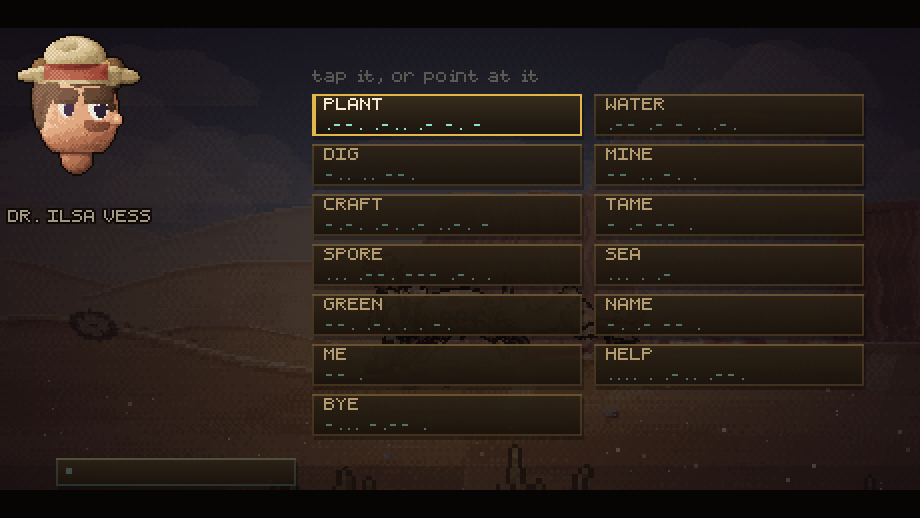

### She notices things

She is the only one of you who can read this desert, so she says so. A hostile
inside a hundred and thirty and she **shouts** — and a shout is not a bigger
speech bubble, it is a different one: hot paper, red ink, a hard red edge, spikes
round the outside and the whole card shaking on the spot, over the top of
whatever she was in the middle of saying.

> **BEHIND YOU — DUNE SCORPION!**

She shouts when you are down to a third of your blood, and when the sand is
coming. She remarks — quietly, at conversational volume — on a seam under your
feet, on a fossil sitting far higher in the section than it has any right to, on
a plant about to die of thirst, on a tank nearly dry, on an animal that has
decided it will sing with you, and on the sun going down. Each one has its own
cooldown and its own memory, so she never says the same thing twice in a row and
never talks over herself.

### The rest

- **Everything out here leaves the ground.** A body that jumps squashes on the
  way out and stretches at the top; a jerboa hops as its ordinary gait; and a
  hunter does not simply run at you — it drops, gathers for half a second, and
  throws itself the last stretch. That wind-up is the only warning you get.
  Anything that eats meat will stop for a body instead of for you, and stands
  over it biting pieces off, which is the one reliable way to walk past a hunter.
- **Things bleed.** A blow throws blood the way the blow went, each drop
  stretched along its own path so a spray reads as a spray; a killing blow opens
  it up properly; and what lands **stays on the sand**, because a desert keeps
  what you spill on it. Insects bleed the wrong colour.
- **The air is not still.** Above a breeze, three sheets of grain cross the frame
  at three different speeds, and in a real sandstorm a wall of it comes over the
  whole picture.
- **Terrain** is a heightfield over X, baked into 256px chunks, with a live
  deformation map. Sand is a fluid in no hurry: it **slumps**, so a pit with a
  sharp edge pulls its neighbours in and what you dig becomes a cone rather than
  a slot, and it **fills** on the wind — but the rate falls off with depth, so a
  footprint is gone in a minute and a three-metre mine shaft is still there when
  you come back. Break ground anywhere and **something that was living in it
  comes out**: beetles and grubs that land running, scuttle along the surface,
  and go back under a little way off. The desert looks empty because everything
  in it is underneath.
- **Parallax** is three layers with real aerial perspective: each layer is
  painted into a scratch canvas and hazed toward the sky colour with
  `source-atop`, so distance desaturates the buttes without washing the sky.
- **Heat shimmer** blits the scene to the display in 2px horizontal bands with
  per-band sine offsets, strongest near the horizon. The UI is composited after
  it, so text never wobbles.
- **Weather** runs a real clock: clear, sandstorm, heatwave, rain, overcast and
  lightning, each with its own light colour, shadow length and haze.
- **Input** routes mouse, keyboard, multi-touch and the on-screen controls into
  the same virtual keys, so no gameplay code knows which one you used.
- **The HUD is not a HUD.** Water is a moulted shell with the water visibly in
  it; nutrients are a flower that opens as you bank them and drops a leaf when
  you spend; fruit is a sprig of fruit; your genome is an orb. All four are
  painted by the same height-field painter as the world, so the readouts are
  lit by the same sun as the desert behind them.
- **The game is quiet.** What a plant costs, what it pays, how long it takes and
  what it needs are **chips with icons** — a drop, a fruit, a clock, a weight, a
  sun or a moon — not sentences. A death, a hatching and a note taken are
  **popups over the thing they happened to**, not banners. The controls are five
  **keycaps** along the bottom that fade out once you have been playing a few
  minutes, and come back if you reach for them. What is left of the writing is
  spoken: Dr. Vess says it, in her bubble, with her face doing the work.

### The interface is made of something

The HUD is not a set of rounded rectangles. Everything it says sits on a
**riveted brass plate** — a bevelled slab with a lit top edge, a shadow under
it and a rivet in each corner — so the place name, the weather, the day, the
clock, the control keycaps and the toast all read as parts of one instrument
rather than as text floating over the sky. Gauges are **brass-bound glass**:
end caps you could unscrew, a tick every quarter, a lit top edge on the fill, a
shadow under it and a meniscus at the leading edge, so a level reads as a level.

And when Dr. Vess talks, she talks on **a page out of her own notebook**: cream
paper with a ruled red margin, a faint rule under every line, a torn lower edge,
her face pinned to it behind four brass tacks, and a dog-eared corner pointing
at whoever is speaking. Tapped code gets the same card in ink-blue, because a
signal is still something written down.

### Layout

```
js/
  art/       crabart crabpose personart floraart faunaart buildart anatomy
  core/      camera input save
  data/      flora fauna progress lore
  entities/  crab creature npc
  lib/       math font audio palette
  render/    pixel renderer backdrop
  systems/   garden economy wildlife encounters green digs talk pump fx
  ui/        ui icons tree
  world/     terrain biomes weather landmarks
```

---

## Screens

| | |
| --- | --- |
|  |  |
|  |  |
|  |  |
|  |  |
|  |  |
|  |  |

---

## Notes

Runs at 60fps from 320×200 up to 4K, on desktop and on a phone. Tested against
landscape phone, portrait phone and tablet profiles with real touch events.

On a narrow screen the HUD is a different layout rather than the same one
squeezed: the place name takes whatever room is left, the day count and the
"places found" line drop, the thumbstick grows and gets chevrons, and the
buttons lay themselves out along the bottom from the valve leftwards, wrapping
up a row rather than ever landing on the stick or on the spring — and a button
only exists when there is something to press. Up on your own back the rail owns
most of a phone screen, so the readouts collapse to one line, the stick and the
action buttons go away entirely, and the only thing left is **CLIMB DOWN**.
Save data lives in `localStorage` under `crabden.save.v1`; clearing it starts a
new run.

Everything in the game — every plant, every animal, the crab, Dr. Vess, the
terrain, the sky, the font and the sound — is generated at runtime from code.
There are no image files.
