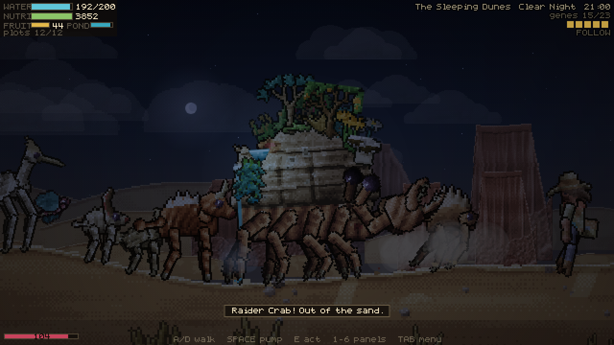
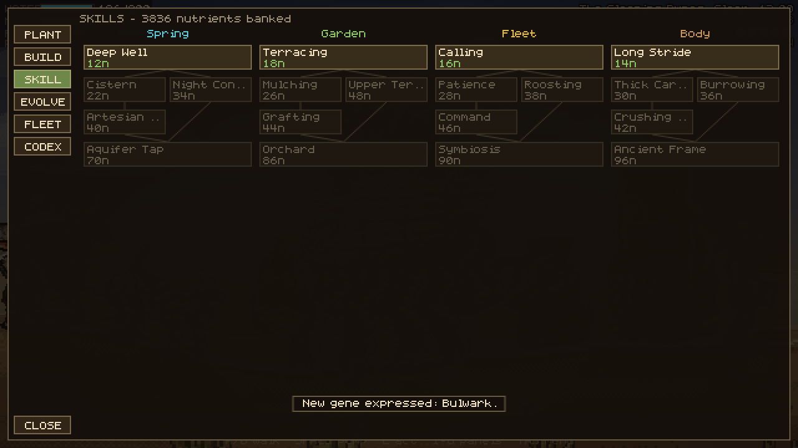
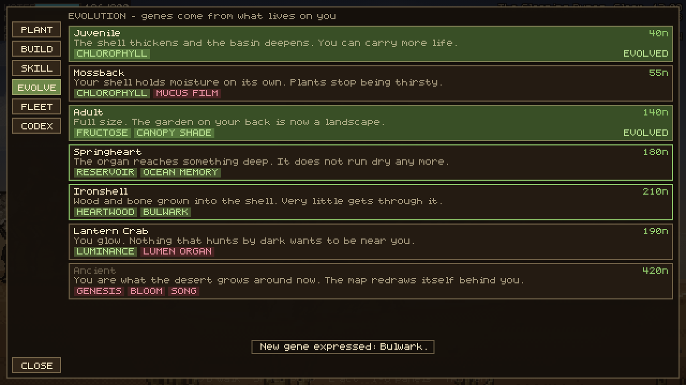
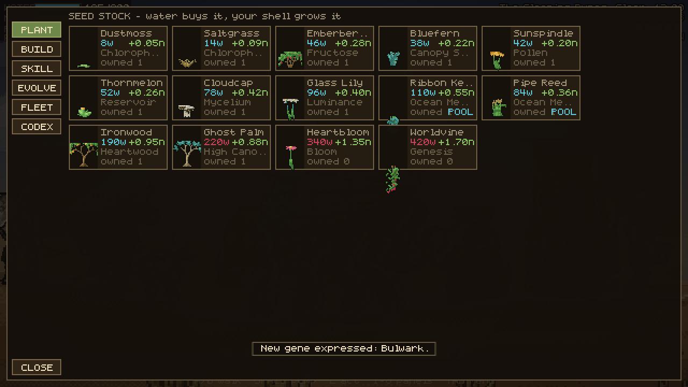

# CRABDEN

You are a crab. You have been asleep for a thousand years. The ocean you fell
asleep in is gone, the seabed above you is now a desert, and the thing that
woke you was an archaeologist relieving herself on what she took to be a rock.

There is a spring in your back. There used to be a sea here because of it.

**CRABDEN** is a side-scrolling pixel-art ecosystem tycoon. Water is currency.
You pump it out of the organ in your shell, spend it on seeds, and grow the
plants *on your own back*. Plants fix nutrients and express genes; genes are
the only thing that unlocks evolution; the garden you are carrying decides
which of the desert's thousand-year descendants walk out of the dunes to live
on you. Some of them join your fleet. Some of them come up out of the sand at
night with their mouths open.


---

## Play it

**Single file, no install, no server.** Open `dist/crabden.html` in any
browser — including straight off the filesystem.

```
git clone https://github.com/PukkingDragon123/solid-fishstick
open solid-fishstick/dist/crabden.html
```

To run from source, or to rebuild the bundle after a change:

```
npm install       # esbuild only, used for the bundle
npm start         # http://localhost:8080
npm run build     # -> dist/crabden.html + dist/crabden.body.html
```

## Controls

|  | keyboard | touch |
| --- | --- | --- |
| walk | `A` / `D` or arrows | left thumbstick (drag anywhere in the lower-left) |
| pump water | `Space` | **PUMP** |
| act — dig, harvest, tame, strike | `E` | **ACT** |
| panels | `1`–`6`, `Tab` | **MENU**, then the tab rail |
| zoom / pan | wheel, drag | pinch, drag |
| close | `Esc` | **CLOSE** |

The game autosaves every twenty seconds and reloads where you left off.

---

## The loop

**Water → plants → genes → evolution → more water.**

1. **Pump.** The organ on your back brings up water, and overflow fills the
   stone basin behind your crest. When the basin is full it runs off the back
   of your shell as a waterfall and wets the sand you are standing on.
2. **Plant.** Water buys seeds. Seeds go into plots along your shell — ten dry
   beds on the rock and two wet beds in the basin, which only take plants that
   want their feet wet. Everything grows in place as you walk.
3. **Mature.** A mature plant fixes nutrients every second and expresses a
   **gene**. Genes are not purchasable. The only way to hold a gene is to be
   carrying something alive that expresses it.
4. **Attract.** Every species scores your shell — which genes it expresses,
   how lush it is, whether there is standing water — and only makes the walk
   when the score is worth it. Get close, offer fruit and water, and it joins
   your fleet and starts working.
5. **Evolve.** Evolutions cost nutrients *and* a specific set of genes. Growing
   from juvenile to adult to ancient makes the shell bigger, the basin deeper,
   and the garden on your back larger in every sense.

### The four skill branches

**Spring** (deeper wells, bigger tanks, night condensers) · **Garden**
(terracing for more plots, mulching, grafting, orchards) · **Fleet** (calling,
patience, standing orders, roosting) · **Body** (stride, carapace, pincer,
burrowing). Skills are cheap and broad and cost nutrients. Evolutions are rare
and structural and cost genes.

### Building on yourself

Cisterns, windcatchers, compost frames, roosts, trellises, a watchpost and a
salvaged shrine are built into free shell plots and stay there. They are
permanent stat changes you can see from across a dune.

---

## What is out there

Seven biomes run for forty thousand pixels: the Weeping Salt Pan, the Bone
Reef, the Sleeping Dunes, the Glass Flats, the Rustlands, the Ashwood and the
Deep Well. Each has its own sky, ground, rock and residents.

Points of interest are generated deterministically from the world seed, so the
ruin you walked past is still there tomorrow: buried relics, wild seed patches,
water seeps, ruins to salvage, old kills, nests — and disturbed sand, which is
not a point of interest so much as a warning you probably will not read in
time.

Hostiles do not bother a bare rock. Once you are carrying something worth
taking they start arriving, faster at night: rust scarabs in threes, husk
hounds in pairs, a thornstalker that buries itself along the path you are about
to take, a raider crab that wants your garden rather than you, and, in a
sandstorm, whatever a sandstorm makes.



---

## How it is built

No engine, no framework, no dependencies at runtime, and **no asset files at
all**. Every pixel in the game is generated in the browser when it starts.

### The painter

`js/render/pixel.js` is the reason the art looks the way it does. Sprites are
not drawn with strokes and fills — each one is built as a set of fields
(coverage, height, material, tint) and then *shaded*:

- surface normals come from the gradient of the height field
- lighting is lambert + rim + a cavity term (local height minus blurred height)
  + specular + subsurface translucency for leaves and membranes
- the result is quantised onto a per-material eight-colour ramp with 8×8 Bayer
  ordered dithering, then given a dark outline

`js/lib/palette.js` holds about forty materials — chitin, shell rock, claw,
leaf, moss, petal, berry, sand, bone, rust, water, fur, feather, scale,
carapace, membrane, horn, rope, cloth, metal, glass, skin, khaki, leather — so
a fern frond and a crab's leg are lit by the same sun and sit in the same
desert. Everything is baked once into a canvas at load.

### The crab

`js/art/crabart.js` builds the shell from a single profile function that is
also the source of truth for where you can plant: horizontal bedding like the
mesas it slept among, eroded shelves, fracture lines, desert varnish streaking
down the flank, crest spikes, fossil barnacles, and a real stone basin behind
the crest for the spring to fill.

`js/entities/crab.js` walks it. Nothing is a sprite animation: each leg keeps a
planted foot in world space, takes a step when the body has carried it too far,
and every joint is solved with two-bone IK — so a leg on a dune slope and a leg
in a hollow bend differently on the same frame. The body then rides on a line
fitted through whichever feet are currently on the ground, which is what makes
it tilt going uphill.

### Plants and animals

Plants are grown, not drawn (`js/art/floraart.js`): a stem is traced, branches
split off it with a seeded angle, and leaves, petals and fruit hang on the
tips. The same generator runs at every growth stage and at any size, so a bush
you planted as a seed really is the same bush when it fruits, and a plant on an
ancient crab's shell is a bigger version of the same individual.

Animals share one generator (`js/art/faunaart.js`) driven by proportions — how
deep the chest is, how long the neck runs, fur or feather or carapace — and
bake body, head, neck, limbs, wings and tail separately so they can be posed at
runtime. Every one of them walks on solved legs and keeps its feet on the sand.

### The rest

- **Terrain** is a heightfield over X, baked into 256px chunks, with a live
  deformation map that footsteps push down and wind pulls back up.
- **Parallax** is three layers with real aerial perspective: each layer is
  painted into a scratch canvas and hazed toward the sky colour with
  `source-atop`, so distance desaturates the buttes without washing the sky.
- **Heat shimmer** blits the scene to the display in 2px horizontal bands with
  per-band sine offsets, strongest near the horizon. The UI is composited after
  it, so text never wobbles.
- **Weather** runs a real clock: clear, sandstorm, heatwave, rain, overcast and
  lightning, each with its own light colour, shadow length and haze.
- **Input** routes mouse, keyboard, multi-touch and the on-screen controls into
  the same virtual keys, so no gameplay code knows which one you used.

### Layout

```
js/
  art/       crabart floraart faunaart humanart buildart
  core/      camera input save
  data/      flora fauna progress
  entities/  crab creature npc
  lib/       math font audio palette
  render/    pixel renderer backdrop
  systems/   garden economy wildlife encounters fx
  ui/        ui
  world/     terrain biomes weather
```

---

## Screens

| | |
| --- | --- |
|  |  |
|  |  |
|  |  |

---

## Notes

Runs at 60fps from 320×200 up to 4K, on desktop and on a phone. Tested against
landscape phone, portrait phone and tablet profiles with real touch events.
Save data lives in `localStorage` under `crabden.save.v1`; clearing it starts a
new run.
