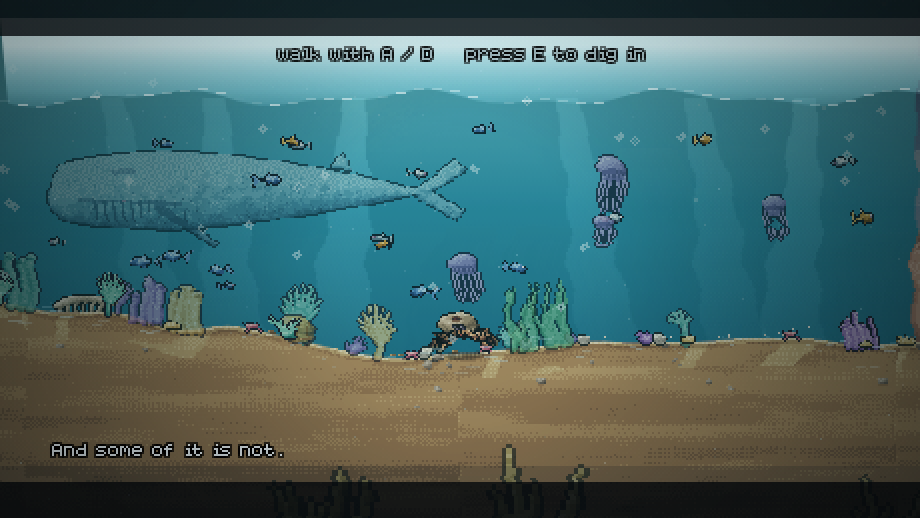
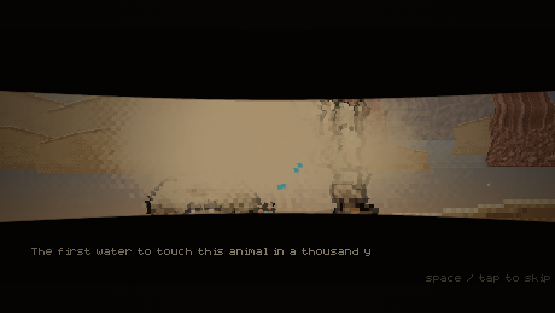
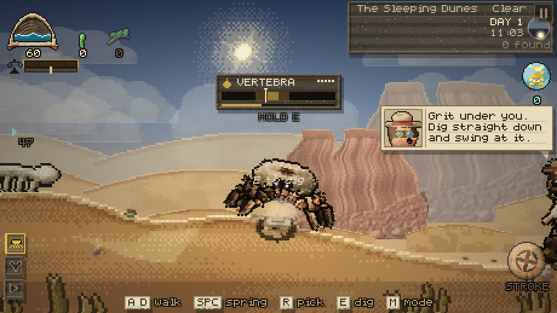

# CRABDEN

You are a crab. You have been asleep for a thousand years. The ocean you fell
asleep in is gone, the seabed above you is now a desert, and the thing that
woke you was an archaeologist relieving himself on what he took to be a rock.

There is a spring in your back. There used to be a sea here because of it.

**CRABDEN** is a side-scrolling pixel-art ecosystem tycoon. Water is currency.
You pump it out of the organ in your shell, spend it on seeds, and grow the
plants *on your own back*. Plants fix nutrients and express genes; genes are
the only thing that unlocks evolution; the garden you are carrying decides
which of the desert's thousand-year descendants walk out of the dunes to live
on you. Some of them join your fleet. Some of them come up out of the sand at
night with their mouths open.


---

## Play it

**Single file, no install, no server.** Open `dist/crabden.html` in any
browser — including straight off the filesystem.

```
git clone https://github.com/PukkingDragon123/solid-fishstick
open solid-fishstick/dist/crabden.html
```

To run from source, or to rebuild the bundle after a change:

```
npm install       # esbuild only, used for the bundle
npm start         # http://localhost:8080
npm run build     # -> dist/crabden.html + dist/crabden.body.html
```

## Controls

|  | keyboard | touch |
| --- | --- | --- |
| scuttle | `A` / `D` or arrows | left thumbstick (drag anywhere in the lower-left) |
| dig in (opening only) | `E` | **DIG IN** |
| the spring | tap `Space` in time with the gauge | tap the valve in time with the gauge |
| pick what is ripe | `R` | **PICK**, or tap the bead over a plant |
| build on your own back | click your **shell** | tap your shell |
| start digging | click your **body** | tap your body, or hold **DIG** |
| put a parasite on something | `X` | — |
| put a relic in your basin | `K` | — |
| sit down with him | `C`, or click him | tap him |
| say something | click it, or arrows + Enter | tap it |
| answer him | `1` / `2`, or click | tap it |
| ask him what needs doing | say `What needs doing?` | the same |
| dig / pick / search | hold `E`, tap `E` on the band | hold, tap the band |
| water a new seed | click the drop over it | tap the drop |
| Vess: follow, get on, get off | `F` | — |
| act — dig, win over, strike | `E` | **ACT** |
| fleet / bench / field notes | `1` / `2` / `3` | **SHOP**, then a tab |
| inside you | `G` | tap the orb |
| control mode | `M` | **MODE** |
| zoom / pan | wheel, drag (locked while you are on your own back) | pinch, drag (same) |
| switch mode | `M`, or click one of the five chips | the same chips |
| swing the claw (HUNT) | `Q` | drag the **claw stick** at it |
| guard / parry (HUNT) | hold `S` | hold **GUARD** |
| roll (HUNT) | `Shift` | **ROLL** |
| an ability (HUNT) | click its slot | the same |
| the spore (SPORE) | hold `V`, release at pressure | hold the button |
| take one of yours (HIVE) | click it, or its token | the same |
| sing back (taming) | `1`-`5` | the pitch keys |
| the menu | it is where you start | the same |
| lure him in | `L`, or ask him to come `CLOSER` | the same word on the board |
| spray the spore | `V` (again to let him go) | `SPRAY HIM` while he leans in |
| break a capped vent | `E`, at the cap | **ACT** |
| cut a mast | `E`, at the tree | **ACT** |
| study a wild plant | `E`, at the plant | **ACT** |
| scoop sand / pour it | hold `Z` / hold `Shift`+`Z` | hold **DIG** / hold **POUR** |
| plant a seed | click your shell, then the seed | tap your shell |
| skip a cutscene | `Space` or `Escape` | the **SKIP** plate, top right |
| his pick, once he is yours | `E` | — |
| his bench | `B` | **SHOP**, then BENCH |
| pause / back out | `Esc`, or the chip in the top-right corner | the same chip |

The chip in the corner is the only button that is always in the same place. It
is a **back arrow** while you are inside something and a **pause** while you are
not, and pausing stops the world and gives you sound, a fresh run, and the way
out.

A crab does not turn round to walk — but it does turn round. Reverse direction
and the animal **pivots**: it goes edge-on, comes back out the other way, and
carries on sideways with the other shoulder leading. Everything on its back
turns with it.

The game autosaves every twenty seconds and reloads where you left off.

---

## The opening

### Shot like a nature film

The sea is not a loading screen. It is the world with water in it, and for the
first minute it is filmed the way a wildlife documentary films a reef: long
held takes, a narrator who is interested rather than excited, and one moment
where the camera pulls back to put the animal next to something that makes it
look like nothing at all.

That something is a **blue whale**, and a calf. They are painted the same way
as everything else — a long body with the mass forward of the middle, ventral
pleats under the throat, a flipper swept back, a dorsal fin so small it is
nearly an apology, and flukes wider than you are long. They cross the top of
the column, slowly, pushing water ahead of them, and they do not react to you
and do not turn round. Under them the water is full of **marine snow** falling
for ever.

> And some of it is not.
>
> Two hundred tonnes of animal, and it has never once had to hide from anything.
>
> You will never see one again. Nothing here will.

Lower down, working the middle of the water column, there are **reef sharks**.
They are the opposite shape to a whale in every detail — pointed snout, widest
at the shoulder and tapering all the way back, a hooked dorsal, pectorals held
out flat like wings, and a tail whose upper lobe is twice the lower — and they
behave differently too. A whale crosses once and never turns round. A shark
does a circuit: it runs, leans into a turn at the edge of the shot, changes
depth and comes back, all day, every day of its life.

> This one has been here longer than the reef has. It is not interested in you.

### A thousand years, in four shots

Then you dig in, and the sea goes, and the camera stops being the camera you
play the game with.

This is the difference between a cutscene and gameplay with the camera nudged
about: **whether it ever cuts**. It used to glide from framing to framing over
the mound you are buried in, which is the shot the game already lives in, so
nothing ever felt staged. Now it is four set-ups at four places along the
basin, hard-cut together with a frame of black on each join, all of them far
wider than the game ever gets — and you are not in most of them. A thousand
years is not about you.

Dusk on the drying salt. Night, low and long, looking down the flat. Then a
cut to somewhere else entirely — bare ground six hundred metres away — and one
small knock, and a silence with nothing in it but a little sand coming off the
tops, which is the part that frightens.

Then the shock. It builds for a second, **breaks**, and takes four more to
settle, and the camera does not jitter through it — it *lurches*, a slow heavy
sway with the jitter on top, which is what standing on moving ground is like.
Dust pours off every slope. And while it shakes, the hard beds under the old
seabed **stand up out of the salt as mesas**, seven of them on a stagger so the
skyline arrives in pieces rather than rising like a lift. They come up weathered: flat tops with notches out of
the rim, shoulders that fall away in two steps, horizontal beds crossed by the
vertical gullies the rain has cut into the faces.

> And then the basin remembered it was the bottom of something.
>
> Two hundred metres of seabed, standing up in the sun.

And then, at last, the part that takes the longest and shows the least: a few
tufts of green along the ground line, and a line of birds going somewhere else.

> Nothing lived here for four hundred years. And then a little did.

### You wake up in the dark

You do not wake up looking at something. You wake up with one sense back before
the others, and the picture arrives last. So for a few seconds the frame is
**two eyelids**, almost shut — the inner edge sagging the way a lid does, a wet
rim along it, lashes breaking the line — and all you have is a sound you cannot
place.

Somebody is sitting on it. Somebody has been sitting on it every evening for
eleven years, and what he does while he sits on it is drink.

So the thing that wakes an animal after a thousand years is not geology and it
is not rain. He finishes the bottle, throws it over his shoulder without
looking, and **the bottle is a real object** — thrown, spinning, under gravity —
so it arcs up out of frame and comes down, and where it lands is not scripted.
It lands on the shell. The lids come up on the clonk.

> And then something hits it.
>
> Sorry. Sorry, rock.
>
> Four thousand days and I still apologise to the geology.

(The eyelids in that shot did not used to work at all: `lids` means how *shut*
they are, which is what every line that sets it assumed, but the maths inside
used it as the aperture — so "eyes closed" drew a wide open eye and the whole
sequence played with nothing over it. One minus.)

| | |
| --- | --- |
|  |  |


The game does not start in the desert, and it does not start with a film. It
starts thirty metres under water, **and you can walk around in it**.

There is no separate ocean renderer. The reef is the desert: the same terrain,
the same camera, the same crab, with a sea put on top of it by
`js/systems/sea.js`. Every dune you will later cross is a sandbank down there,
and every ridge is a ridge. That is the whole point of the prologue — you are
looking at the ground you are going to spend the game on, one thousand years
before it dried.

The sea does three jobs. **The column**: everything above the seabed is water,
so the desert sky and the far dunes are painted out of the frame entirely,
before anything in the water is drawn — because the reef and the animal are
*in* it, not behind it, which is the difference between a sea and a blue
filter. Light comes down through it in shafts that lean and sway, caustics
crawl over the sand, silt hangs in between, and if you are shallow enough the
surface is up there being bright.

**The life**: corals placed on the terrain the same deterministic way the dig
sites are, and painted the same way as everything else — staghorn, sea fans
with cross-ties between the ribs, brain coral with real grooves, tube sponges,
anemones, soft weed. Urchins, starfish and shells on the sand, crablets walking
about on it, shoals of fish whose tails beat about the peduncle while the body
leans into the turn, jellyfish pulsing upward, and bubbles coming up out of the
seabed and off you as you walk. Anything big enough to hide you is drawn
behind you.

And **you are hand-sized**. The coral towers over you. That is how you know.

When you have found a hollow you like, you **dig in** — `E`, or the DIG IN
button — and from there the opening is **shot, not just played**.

It is cut into acts, and the camera is a camera. The dig is a **push in**, tight
on the animal working itself under in a burst of silt. Then the sea starts to
leave and the camera **pulls wide** and drifts, so you watch it go from the whole
basin rather than from on top of the animal: the surface walks down the world,
the reef thins out, the blue comes out of the light, and a counter runs to 1,000
on a slate held high in the frame.

Then it **cuts to black**. A thousand years does not get a dissolve. The card
comes up — ONE THOUSAND YEARS, *and nothing at all happens* — a rule draws
itself out under it, and the black lifts onto a **montage**: four held frames of
the same mound, hard-cut between rather than faded, each one a different hour, a
different angle and a little further into the desert, every one of them creeping
so a held shot is still a shot and not a paused game.

Black again, and then the widest frame in the game: an empty basin at nine in the
morning with **one person walking across it who is far too small for it**. The
camera holds, drifts in, and only then cuts to the shell. Every beat under it is
a framed shot with its own drift, the frame carries a vignette and letterbox bars
throughout, and the eruption **snaps wide** to give a thousand years of sand
somewhere to go.

You are still under it with only your shell showing, and a woman who has been
wrong about a rock for eleven years sits down next to you.

| | |
| --- | --- |
|  |  |
|  |  |


---

## The loop

**Water → plants → genes → evolution → more water — and the whole time, keep
walking, because the only thing out here worth having is over the next dune.**

1. **Pump.** The spring is a muscle with a rhythm, not a key you hold. A needle
   sweeps a bore and a band marks where the chamber is actually full: tap on
   the band and the stroke lands, tap on the middle of it and it lands
   perfectly, tap anywhere else and you have wasted a stroke. Land them in a
   row and the spring runs harder — and the band narrows, the needle speeds up,
   and past six in a row it **stutters**, reversing without warning, because
   the better you get the less margin you are given. Hammering does not work:
   a chamber has to refill between strokes, and a second push too soon breaks
   the chain. Water goes into the tank, then into the stone basin behind your
   crest, and when neither can take any more it comes over the lip and down your
   shell as a waterfall onto the sand you are standing on.
2. **Plant.** Click yourself to climb onto your own back, then **drag a seed
   out of the rail and drop it on a bed**. It goes in as a seed and does
   nothing at all until it has taken up water — the ring round it fills as the
   basin soaks it, and then it germinates. Seeds go anywhere on the shell;
   there is no slot count. What limits you is **balance**: everything you carry
   has a weight, you can only carry so much, and it matters which side you put
   it on. Overloaded, everything grows slower and you walk slower. Badly
   trimmed, you walk with a list and the heavy side starts to suffer.
3. **Pick.** Nothing on your back pays out on its own. A mature plant **ripens**
   on its own clock — and several of them will not ripen at all unless a
   condition holds: at dusk, after dark, in daylight, in the shade of something
   taller, with water in the basin, with something living on you. When it is
   ready a bead appears over it. Take it and it pays. A mature plant also
   expresses a **gene**, and genes are not purchasable: the only way to hold one
   is to be carrying something alive that expresses it.
4. **Attract.** Every species scores your shell — which genes it expresses,
   how lush it is, whether there is standing water — and only makes the walk
   when the score is worth it. Get close, offer fruit and water, and it joins
   your fleet and starts working.
5. **Evolve.** Evolutions cost nutrients *and* a specific set of genes. Growing
   from juvenile to adult to ancient makes the shell bigger, the basin deeper,
   and the garden on your back larger in every sense.

**Nobody explains this in a wall of text.** Dr. Vess teaches it, one line at a
time, in his speech bubble, and only when you are actually standing in front of
the thing: the spring the first time you look at it, your own back the first
time you have water to spend, the bed the first time you are up there, the
germination the first time a seed drinks, the bead the first time something
ripens, and the shape of the whole loop the first time you pick. Each beat fires
once, and growing is something you can watch happen — the husk splits on a ring
of light, every stage up **springs** the plant with an overshoot that settles,
and a mature one goes off with a ring and its name.

### You cannot buy a seed

There is no shop. A species is gated on two things and they are different
things: **research** — you have to have knelt next to a wild one in the desert
and studied it, which is what turns a plant from scenery into something you
know — and then a **seed**, which studying gives you, and which picking your own
crop gives you back.

Twenty-one species grow here, and every one of them grows wild somewhere,
because otherwise half the catalogue would be unreachable. What is in front of
you depends on which stretch of desert you are standing in.

The other number to plan around is **crops**. Most plants are perennials: they
go on cropping until they die of thirst or you pull them up. Some are
**annuals** — one pick and they are spent, they go over where they stand and
the bed is yours again. An annual pays two or three times as much per pick to
be worth the bed at all, and always hands back seed, which is how it pays for
the next one.

And a plant that is dry **says so**, at any growth stage, before its condition
starts coming off: a cracked empty drop over the bed, which beats faster the
worse it gets.

### Nothing comes out of the ground by itself

Everything this desert had used to arrive the instant you pressed a key. Press
E and a fossil that had been in the ground eleven thousand years was in your
hand. **Work takes time now**, and while it is taking time you are holding it.

A job has a length, a worker and a bar, and across that bar a needle sweeps.
Land your stroke in the band and the work goes faster and cleaner; land it in
the narrow core and faster still; land it outside and you have wasted the swing
— and on something fragile, cracked a piece off it. Let go and the job waits
where it is, because putting the trowel down is allowed.

It is one system because it is one idea: **digging** a fossil out, **picking**
fruit off the stem, **searching** a ruin, **sinking** a plant and **pouring**
water are all somebody kneeling down and doing something with their hands for a
while. The tablet is drawn at the work rather than in a corner, because the
thing you are looking at while you dig is the hole — and the quality pips on it
are the number that matters: a fossil dug badly comes out in pieces, and he
tells you so.

> You have broken it. It was eleven thousand years old and you have broken it.



### Planting is a job somebody does

You do not buy a plant. You pick the bed and the seed, and then **somebody has
to walk over and put it in** — which for most of them is not you. A crab is a
magnificent animal with a claw the size of a door and no way at all to hold a
seed the size of a grain of sand, so **a plant can require particular hands**:
his, a real tool out of his bench, or something of yours that digs for a
living. The seed card says which before you try, and says why.

So he walks over, **climbs onto your back**, opens the ground, puts it in and
covers it, and the whole of that takes the better part of ten seconds you can
watch and help with. The bed shows the hole deepening and the spoil heaped
beside it. What goes in is a seed, and **a seed does nothing at all until it is
watered** — there is a drop bobbing over it until you pour, and pouring is its
own job with its own band.

> In, and in properly. Now water it, or all of that was me digging a hole.

### The front door

There is a title screen, and it is the game rather than a picture of a logo:
**your own crab**, out of your own save, standing in a sandstorm — and Dr. Vess
beside it, **drinking a beer**. He takes a pull every couple of seconds, the
bottle empties as he does, he looks at the empty one for a moment, and then
he throws it — a real bottle on a real arc that spins, bounces once and lies in
the sand until the desert takes it back. Then he opens another, because there
is nothing else to do out here and there has not been for eleven years.

The storm behind it is real weather with the wind turned up, blowing in gusts so
the title is never evenly lit, with lit grit blowing past over the top of it and
the selected plate breathing where your hand is. There are two words on it:
**START** and **SETTINGS** — sound, touch controls, and **erase everything**,
which asks you twice and means it.

The name sits on **a board**, not on the sky: the same wood, the same steel
corner clasps and the same brass as every other screen in this game, hung in
the storm. And a plank under it says what START is actually going to do —
*CONTINUE — DAY 5, ADULT*, or *A NEW ANIMAL, IN AN OLD SEA* — because one door
labelled START whether it is waking you out of the sand or dropping you back
where you left off is a door you cannot read until you have gone through it.


### One thing you can be doing, and then four

**You start with one mode.** The column used to open with five badges in it,
which is five things to learn before you have done anything, and four of them
did nothing for an hour — a claw with nothing to fight, a nerve with nothing on
it. One of the five has since been deleted outright. So the column GROWS. Each mode arrives at the moment the world first hands
you the thing it is for, and it arrives as a card that stops the screen, says
what just happened and says what the mode is:

| mode | it turns up when |
| --- | --- |
| **CRAB** | you wake up. It is the animal, and it is all you need to start |
| **HUNT** | something hostile is actually coming at you |
| **SPORE** | you are carrying something to put in the gland |
| **HIVE** | there are enough of them on your nerve — the **command** skill |

The bottom-left corner is that column, and each badge is **a picture of the
thing, painted pixel by pixel** rather than a symbol standing in for it:
the animal standing square on, the same animal mid-stride with its legs gathered
one way, a claw about to close, a spray head with what comes out of it, and a
nerve with everything strung off it. The one you are in sits proud of the
others like a pressed key, lit in its own colour with a bar down its edge and a
wash of that colour behind the art.

**And it shows on the animal, not only in the corner.** The crab's own eyes take
the mode's colour and burn a little at the back of them — red in hunt, violet in
spore, cold blue in the hive, green in roam — so you can tell what you are
holding by looking at the thing you are holding it with. Beside the column is
whatever that mode actually puts in your hand, and it changes completely
between them.

**CRAB** steers, and it is also where you work: the same bar carries **DIG**
and **POUR** for the sand and **PLANT** for your own back, because walking
around and digging holes is one activity and it was never worth a mode of its
own.

There used to be a **ROAM** mode that walked the animal to a pin you dropped.
It is gone. Walking is the one thing you do in every second of this game, and
a mode that does it for you is a mode that removes the game — and one more
badge in the corner you had to learn before you could press anything.

**HUNT** is a duel, and it has exactly three verbs.

The sweeping needle is gone. It was a slot machine bolted to the side of a
fight: you watched a gauge instead of the animal trying to bite you. Now you
watch the animal. Everything that wants to hurt you **winds up first** — it
plants its feet, stops moving, and takes between half a second and a second
and a half to commit, longer the bigger it is — and the bar above your claw
fills as it does. That fill is the whole combat interface. What you do with it
is your business:

- **STRIKE** (`Q`) swings the claw. Where you swing decides what it does: low
  sweeps the legs and trips it, high catches the head and staggers it, and
  anything already staggered takes more than twice as much. Land them in a row
  and the chain climbs.
- **GUARD** (`S`, held) puts the claw between you and it. A blocked hit costs
  you most of its damage and some stamina instead.
- **ROLL** (`Shift`) is the answer to a wind-up you cannot block. You are
  untouchable for a quarter of a second in the middle of it, and then you are
  standing somewhere else.

Raise the guard **just as the blow lands** and it is a **parry**: no damage, and
the thing that swung at you is off its feet and open. That quarter-second is
the one piece of timing left in the fight, and it is timed against a creature
rather than against a needle.

Stamina runs all three. Rolling costs the most, guarding bleeds while it is up,
and swinging with nothing left is a slow swing. Beside the bar sit the
abilities your genome has actually grown: **Thorn Hide**, **Bulwark**, **Strike
Reflex** (the next swing cannot miss), **Apex Nerve**, **Lumen Organ**
(everything looking at you flinches), **Signal Skin**.

**On a phone the claw is a joystick.** It sits in the corner where the valve
lives and you **drag it at the thing** — direction is the swing, so dragging low
trips and dragging high staggers, and the same two plates beside it are GUARD
and ROLL.

And it is not bloodless. A hard enough hit **takes a leg off**, and the leg goes
with it — it flies, it lands, and it stains the sand where it lands, and the
animal limps on the ones it has left. What dies **stays dead where it fell**:
the body topples, it does not fade out, and it lies there until something has
picked it over or you have walked a long way away. Everything in the desert that
eats meat knows where it is.

**SPORE** is a throw. Hold to build pressure and the arc goes further out; let
go inside the band and the cloud lands where the arc said. Let go early and it
falls short. Hold too long and it goes off on the animal holding it.

And the corner stops being a spring. In spore mode the **water shell becomes the
gland** — a sac of violet fluid slung under a ring of chitin, with things moving
about in it, swelling as the pressure rises — and the **valve becomes a nozzle**,
which is a ring of muscle with a spout through it that clenches as you squeeze
rather than opening like the valve does. What it throws is not water and does not
behave like water: the motes hang, drift upward and wander off, and the gauge
beside it has a band that throws and a red end where it bursts. The mode bar
beside it stops repeating the charge and tells you the thing you actually need —
who is in range, and whether the spore would take in them, with the three ways in
(hurt it, feed it, or earn it) shown as chips that fill in.

**HIVE** is everything on your nerve, and the nerve itself.

### It is all made of something

Nothing in the interface is a rounded rectangle. There are **three surfaces and
no fourth**, and they are all things he actually has with him.

**Stone** is the default: a slab of the same rock the mesas are cut from,
knocked square, bedded, gritted, with the corners chipped off and the shape
carved into it as a sunk channel — dark on the lit side, bright on the far one,
so it reads as cut rather than drawn. That is what a readout is, and what the
words you tap at his are, because you say them by hitting something hard.

**Paper** is a leaf out of his field notebook: warm off-white with the fibre
showing, ruled every nine pixels because that is the line height of the font, a
red margin down the left and a torn bottom edge that bites differently every
time. That is what anything he wrote or said is — so his answers come on it,
in ink.

**Scroll** is parchment with the roll still on both ends. **Leather** is his
bag, stitched just inside the edge. Each surface is baked once per size and
blitted, so a notebook page costs one draw rather than a hundred.

### The frame takes the colour of your hand

What you are holding is not a chip in a corner — **it grades the whole world**.

**HUNT** drops the frame into a hot red: the sand goes bloody rather than brown,
the edges close in hard, two bars of heat breathe along the top and bottom on the
strike beat, a scanline crawls, and every landed hit kicks a bright pulse through
the lot of it. Some rows of the picture jolt out of line as it goes, so the whole
screen flinches.

**SPORE** goes the other way: violet, lifted rather than darkened, with the
frame breathing closed slowly and spores hanging in the air drifting up across
everything. And the world **warps** — long, slow, low waves that run down the
picture out of phase with each other, so nothing you are looking at is quite
still. Both are built out of the same square pixels as the rest of the game.

| | |
| --- | --- |
|  |  |

| | |
| --- | --- |
|  |  |

### What is yours

The third readout in the corner used to be a count of fruit, which told you
nothing you could act on. It is **the animals themselves** now: each one drawn
as its own head, on its own plate, with the thread of what is left of it
underneath and a breathing frame round whichever one you are currently riding.
Click one and you are it. Until you have any, the slot shows the sprig instead —
because fruit is how you get the first one, and the slot should say what fills it.

### The small print of the desert

Under the bestiary — under everything big enough to matter to you — there is a
layer you are not supposed to notice until you stop and look, and then cannot
stop noticing. **Twelve small animals**, none of which can be tamed, fought,
eaten or collected. They are not content. They are the reason a frame with
nothing happening in it is still worth looking at.

Each is its own animal rather than a recolour: its own silhouette drawn by hand
at eight or ten pixels, its own way of moving, its own hours, and its own opinion
about wind. **Skitterlings** run in bursts and stop dead, never in the middle of
anything. A **glass mite** is so transparent you see its shadow before you see
it. **Salt fleas** jump their own length forty times a minute. A **dust moth**
flies badly on purpose, because nothing that eats it can predict it either.
**Piper gnats** stand in a column over one spot all morning. An **ash tick**
holds absolutely still on a stone until something warm goes past. A **lantern
fly** is cold green and goes out the moment you look at it. A **bone burrower**
surfaces, turns its head once, and is gone before you are sure. And a **sand
shrimp** has had a thousand years and still has not accepted that the sea has
gone.

They live in deterministic colonies, so the same stretch of desert has the same
small life in it every time you walk back down it — and a sandstorm drives the
lot of them into the ground.

### The dream

While you are in the hive the world goes over. The whole frame grades cold and
a little bit wrong, slow bands of light cross it out of step with each other so
nothing in the picture sits still, three pulses travel out from your shell along
the nerve, and every animal on that nerve is haloed and strung back to you by a
thread with a bead of signal running down it. The frame breathes closed at the
edges. Your roster is a row of tokens along the bottom with a thread of health
under each; click one and you are it, and A / D walks it.

### A song, not a purchase

**You do not buy an animal.** There is nothing to buy one with and nothing out
here that wants what you have.

What you do is put out the thing its species actually crosses a desert for, and
it is different for every clade: **berries for the birds**, **standing water for
the reptiles**, **a flower in bloom for the insects**, **shade for the small
nocturnal things**. All four are things already on your back, so baiting a bird
means growing what a bird wants. A ring fills on the animal as it decides about
you, and when it is full a note bobs over its head, and it sticks to you.

Then you have to talk to it, and neither of you has words — so you do what two
animals without words have always done. **It gives you a phrase and you give it
back.** The phrase is a row of blocks whose heights are the pitches; it sings
them at you, and then you sing them back on the number keys, on the beat. Four
phrases, getting longer and faster. Fumble one and you lose ground but not the
animal. Get most of them and it joins you — and a bird's range is wider than a
lizard's, which is most of why a bird is harder.

A spore is the other way in, and that has a condition of its own: **it only
takes in something willing**. Worn down, fed, or already half trusting you. An
animal that is none of those throws it off, and remembers that you tried.

| | |
| --- | --- |
|  |  |
|  |  |

### Hands

**You have claws the size of a door and no thumbs.** That is the whole problem,
and there is exactly one solution to it walking around the basin.

It takes three steps, on purpose, so none of it happens by accident. **Lure**:
get his head down. Either put an artefact on the ground in front of you — he
has been wrong about a rock for eleven years and he cannot walk past one — or
simply **talk to him and ask him to come closer**, which he does, grumbling
about it, and for eleven seconds his head is at the height of your gland. He
does straighten up again; he is suspicious, not stupid. **Spray**: a spore, at
close range, while he is down — out in the world on `V`, or as the one word on
the board that only appears while he is actually leaning in. There is a beat
where he knows. **And then his eye goes blue and stays blue**, and he stops
talking, because there is nothing left in there doing the talking.

While you have him he does what you point him at and nothing else. He walks
on your keys. He swings a pick. He works the bench. Press `V` again and you
let him go, and he comes round a hundred metres away having lost an hour, and
says so.

### Mining

Under the basin are **seams**, and they are deterministic — the same seed puts
the same copper in the same place for ever. Shell hash near the top, salt sheets
under it, then silica, then the copper that was dissolved in the sea when it
dried, then amber, and at the bottom iron, where the water was deepest and
stayed longest. A seam you have not reached yet shows as a **glint in the
ground** that brightens as your hole gets near it, so the desert tells you where
to dig instead of making you guess.

Every swing takes a bite out of the ground whether or not there is anything
under it, so getting down to a deep seam is the work. Once a seam is open it
takes hits, cracks a little more with each one, and then breaks.

The ladder closes, so nothing needs a pick made out of itself: **his trowel gets
everything down to copper**, copper buys the **copper pick**, and the copper pick
is what opens **iron and amber**. The iron pick is not a gate — it is just
faster, and it drops an extra lump.

### Crafting, and a base on your back

The bag is his, because he is the one with hands. The tree is three tiers and
it runs **through the garden**: ore melts into bar at the **kiln**, bar becomes
part at the **bench**, part becomes the thing that goes on your back — and the
kiln and the bench are both things you build on your own shell. So the loop is:
mine, refine on the animal, build on the animal, mine deeper.

Grit and salt press into **bricks** by hand; shell winds into **spool**. Copper
and iron go to **bars** at the kiln, silica and salt to **glass**. At the bench:
**gears** out of copper, **pipe** out of iron, **pane** out of glass, and then
the two picks and the **spore sprayer** that made all of it possible in the
first place. Every card in the panel shows what it needs as icons, greyed with a
reason when he cannot make it yet.

| | |
| --- | --- |
|  |  |

### Your genome

There is no skill menu. There is the animal, and you can look into it.

Press `G`, or tap the orb on your own back, and the camera does not stop at the
shell — it **dives**. You rush up at yourself out of the dark, a speck growing
into an animal filling the screen; then through the rock, the chitin and the
pearl, each layer named as it passes, the stars stretching into streaks, and out
the other side into the cavity where the thing that decides what you become is
sitting.

It is a skill tree, and it is built to the rules that make skill trees
readable rather than impressive:

- **Six arms, evenly spaced**, so a direction always means the same system and
  you learn where things are by where they are: FORM straight up, then SPRING,
  SHELL, BROOD, PINCER and LEGS around the clock.
- **Growth runs outward from a seed**, so how far a thing is from the middle is
  exactly how deep into that system you have gone. Each arm forks once and
  comes back together at a keystone, which is drawn bigger and ringed.
- **Nothing is drawn that you cannot reach.** You see what you own and what is
  one step past it, joined by a dashed lead, and a short stub where a chain
  continues. A wall of grey nodes you cannot buy teaches you nothing and makes
  the ones you can buy harder to find.
- **State is readable without reading.** Owned is lit and filled, closed by a
  ring with three lights running round it; affordable pulses; unaffordable
  carries an arc showing how much of its price you have saved so far. Rings at
  each tier and a filling bar beside every arm's name say how deep you are
  without you counting beads.
- **Every node carries a picture of what it does** — a drop, a moon, a saw, a
  spade, a crown — and exactly one effect that nothing else has. Words are for
  the hover card, which tells you what it is, what it costs, and precisely what
  is in the way if you cannot have it.
- **Buying one is an event**: the bead lights, sap runs out from the seed along
  every link it took to get there, two rings open out of the node with sparks
  thrown off them, the screen flares, and the organ at the end of that arm
  visibly grows.

Around the outside is the animal itself. Not a drawing of one: the crab. The
genome screen takes the very rig the desert crab is assembled from, poses it
standing and bakes it (`js/art/crabpose.js`) — the same carapace, the same eight
legs solved through the same IK, both claws, the eyestalks — then fills the
shape dark, lights its outline, and lays the full-colour render back inside it
as an x-ray, so the silhouette you grow your genome inside is the silhouette you
walk around in, joint for joint. It grows as you grow: a hatchling is a coin
with legs here too, and one sprite pixel is never blown up past a fixed size, so
evolving is visible on this screen as well as out in the sand. The basin on its
back holds however much water is actually in it.

Behind all of it is a galaxy, painted once from a bulge, two logarithmic arms
scattered star by star with pink nurseries strung along them and dust lanes
eating their inside edges, then turned very slowly while four layers of near
stars slide across it. Round the seed is a ring of **genes**, which are the one
thing you cannot buy: they light up only while something alive on your back is
expressing them.


### Build mode

There is no shop and there is no build button. **Click your own shell** and the
camera comes in on it, the seeds come out down the side, and you are up on your
own back — which is where planting something on your own back ought to happen.

**Where** you touch the animal decides what happens, which is the only version
of this that makes sense once digging exists. The shell is the garden and always
has been. The body underneath it is the animal — so touching the legs starts it
**digging**, right there, immediately, without a mode or a button in between. **Nothing moves while you are up there.** Not you: it is your shell,
you are standing on it, and the legs are not available. Not the view either —
the camera is nailed to the shell, so a drag is a drag on a plant and a pinch
is not a way to lose the thing you were placing. The spring is shut too; you
are not running anything from up there.

The rail shows what you can carry, what you are carrying, and a grid of seeds
and structures. Pick one and the card at the bottom says what it costs, **what
it pays and how often**, what condition it needs before it will ripen, and what
it weighs. Press place, and every legal bed on the shell pulses, a ghost
follows the nearest one, and a bracket marks where it lands.


### Your fleet, and the parasites

Everything living on you has a card in the **FLEET** panel: what it is, what it
does, how far off it has wandered. Click one and the camera goes to it and the
movement keys become *its* movement keys, until you let go.

Some of them did not volunteer. A **mindcap** fruits parasites instead of food —
things that are almost animals, which hatch looking for a nervous system and
find yours already occupied. Press `X` next to a wild animal and one goes in.
What it takes over, you steer, and a hostile thing stops being hostile the
moment one of your children is in its nerves.

Dr. Vess has opinions about this.

> You just put one of your own children inside a lizard. I am writing that down
> and then I am going to think about it for a long time.

### Bringing it back

The basin was a sea, and you were the reason it was a sea. So the most
interesting thing you can do with water is not drink it — it is **spill it**.

Water coming off your shell soaks into the ground and stays there. Keep a
stretch wet long enough and things come up in it on their own, and stay up, and
hold their own water after that. Walk far enough with the valve open and the
strip behind you is a different colour from the strip in front of you. Vess
notices.

> That is a plant. Nobody planted that.

An **oasis** is just this taken to its conclusion: ground that holds itself
green without you, with reeds standing in the water, ferns and berry on the
banks, and animals that only live where there is standing water.

### What is under the sand

Everything that ever lived here is still here, a metre down. Grow a **digging
claw** and fossil and amber start showing above the sand — a corner of shale, a
bead of amber catching the light from a long way off. Dig one up and it goes in
your pack, and the ground it came out of goes everywhere: a low ring of smoke
spreading outward along the sand, a column of it going up the middle, and a
spray of actual grains thrown clear that bounce once and settle. Everything
that digs in this game uses it — you, Vess over his trench, and the animal
burying itself in the opening, where the same burst is silt instead of dust and
drifts instead of settling.

Then put it in the pool on your own back (`K`) and keep the water up. Given
long enough in standing water, a thousand-year-old thing in a rock **hatches**,
and walks off your shell into a desert that has forgotten it.

> You are going to put a fossil in a puddle on your back and wait. And it is
> going to work, is it? It is, isn't it.

### Living and dying

Everything out here ages. Animals get old and die of it, and your own fleet
turns over — which is the point of **Brooding**, which lets what lives on you
breed on you and replace its own dead. When something of yours dies, Vess says
something about it, and the ground it lies in is richer tomorrow.

The clock in the corner is a real dial: the sun and the moon go round it, the
lit half of the day is light and the dark half is dark, and it counts the days.
Things come up out of the sand at night.

### There is no map

There was one: a strip chart of the basin with everything you had found on it.
It is gone, and the game is better without it. The world is **one line** — you
walk left or you walk right — so a map of it was a picture of a line telling
you the thing the compass already tells you and the horizon already shows you.
What replaced it is nothing: you find places by walking to them, and the only
marker in the game is the one over the man who wants something done.

---

## What is out there

Eight biomes run for fifty thousand strides: the Shallows, the Weeping Salt
Pan, the Bone Reef, the Sleeping Dunes, the Glass Flats, the Rustlands, the
Ashwood and the Deep Well. Each has its own sky, ground, rock and residents.

The ground is not a ramp you slide along. **Boulders** raise it — the sprite is
cut to exactly the curve the terrain adds, so what you see and what you climb
are one object and there is no collision code anywhere. **Rock formations** —
buttes, benches and fins of the harder beds, left standing where the wind took
everything softer away — go up in terraces, and a terrace is a step an animal
can take, so a formation is something you climb rather than something you walk
around. Going up one costs you: the animal rears, throws grit off the face and
crawls. Between them: dead thorn, driftwood snags, the ribs of
something that did not make it, and **tumbleweed**, which spawns upwind
off-screen, rolls at the speed of the actual wind, bounces off the rocks and
goes.

### The sea that never left

Walk far enough west, past the salt pan, and the shelf goes over and the water
is still standing on it — the same corals and shoals and drifting things the
prologue had, because they are the same animals. They stayed where the water
was.

It is not a screen and it is not swimming. You are a crab: you wade in, the
light goes green and then blue, the water takes nearly half your speed, and
everything you do down there you do on the bottom.

### Masts

The only tree in the basin is not a tree. A **mast** is one ribbed green column
holding a season of rain, a couple of arms that turned up toward the light, and
a woody grey foot where the bottom gave up being green. No leaves, no canopy,
nothing to lose water out of.

Stand at one and cut it, and it takes a while and throws chips: **timber**, the
only long stiff straight thing growing within four hundred kilometres, and
**fibre**, which ties things together and does not care about salt. Every haft
in the game is made of one, so every pick is downstream of a tree. They do not
come back this season, and Vess has an opinion about that.

### Sand is a material

The ground was always a heightfield with slumping, wind fill and live
deformation in it. What was missing was a pair of hands. **Scoop** sand into the
claw, carry it, and **pour** it out somewhere else: the hole collapses at the
angle of repose and fills on the wind over days, the heap you make spreads the
same way, and it conserves — you cannot pour out more than you picked up. You
cannot scoop rock, and it says so.

### The capped springs

The water did not all leave. It went **down**, and the people who were here
found the vents and capped them — a collar of dressed block over the mouth and
a plug driven into it, because a spring you can turn on is worth more than a
spring that runs. Then they died, and the lids stayed shut, and the basin went
to sand with the water underneath it the whole time.

You can find a cap by the bead of water working out of the seam. Five good
swings and the plug goes, and what comes out does not stop: it floods, the
ground drinks it, and everything within four hundred metres that has been
waiting a thousand years comes up at once. It is the largest thing you can do
to this world and it is permanent.

Something always moved in on top of them. It has been walking the same ground
since long before Vess got here and it does not like new arrivals — and it will
not let you turn your back on it, which is the whole shape of the thing: a
fight you have to win for a reward that changes the map.

**Landmarks** are the point of walking. They are generated from the world seed
and sunk into the terrain itself, so an oasis is a real bowl you walk down into
with water standing in it, not a decal — and it is exactly where you left it
tomorrow. Oases, ruined shore towns, bone fields where a herd died on the way
somewhere better, and wind-cut spires. Each one has a name, and a chevron at
the edge of the screen points at the nearest one you have not stood in.


Smaller finds sit between them: buried relics, wild seed patches, water seeps,
old kills, nests — and disturbed sand, which is not a find so much as a warning
you probably will not read in time.

### The bestiary

Nearly everything alive here is a reptile or an arthropod, because those are
what a drying world leaves: a waterproof skin and a way of excreting waste
without spending water on it. Nine reptiles, nine bugs and arachnids, four
furred survivors that never drink, three birds.

You do not read their entries. You **watch** them, and Dr. Vess writes them
down — five field notes per species, unlocked by observation, spoken aloud as
he works them out. Real behaviour: the skink dives into a dune rather than
running across it, the pebbler's spines comb dew into its own mouth, the digger
wasp restarts its entire sequence if you move the prey a few centimetres.

And they are **his** notes, in his notebook, in his hands. If he is not with
you, the field-notes tab tells you how far away he is and which way. That is
the point of keeping him: `F` calls him over, and once you are big enough to
take his weight he rides the near rim of your shell and writes while you walk.

Hostiles do not bother a bare rock. Once you are carrying something worth
taking they start arriving, faster at night: dune scorpions in pairs, a bone
centipede with twenty-two pairs of legs all going the same way, a pale serpent
that is already where you are going, and a stone basilisk that is not hunting
you — it is checking whether you are new.


### What actually happened here

This was a shallow shelf sea. It did not dry up because of a catastrophe. It
dried up because the artesian system that filled it ran through the body of one
very large animal, and that animal went to sleep. Eleven shore towns cut their
cisterns facing the water, moved twice, and stopped. The lore is found rather
than given: fragments come off ruins one at a time, and Vess assembles the rest
as you find places.

---

## How it is built

No engine, no framework, no dependencies at runtime, and **no asset files at
all**. Every pixel in the game is generated in the browser when it starts.

### The painter

`js/render/pixel.js` is the reason the art looks the way it does. Sprites are
not drawn with strokes and fills — each one is built as a set of fields
(coverage, height, material, tint) and then *shaded*:

- surface normals come from the gradient of the height field
- lighting is lambert + rim + a cavity term (local height minus blurred height)
  + specular + subsurface translucency for leaves and membranes
- the result is quantised onto a per-material eight-colour ramp with 8×8 Bayer
  ordered dithering, then given a dark outline

`js/lib/palette.js` holds about forty materials — chitin, shell rock, claw,
leaf, moss, petal, berry, sand, bone, rust, water, fur, feather, scale,
carapace, membrane, horn, rope, cloth, metal, glass, skin, khaki, leather — so
a fern frond and a crab's leg are lit by the same sun and sit in the same
desert. Everything is baked once into a canvas at load.

### No smooth circles anywhere

The one thing that kept escaping the grid was circles. A glow round an eye, the
sun in the sky, a ring off a splash, the shadow under an animal — all of those
went through the canvas arc / ellipse / radial-gradient path, which is smooth,
anti-aliased and continuous, and beside a dithered sprite it reads as a sticker
somebody stuck on the screen.

So `js/render/pix.js` draws every round thing out of squares, on the same grid
the sprites are on, with the **same ordered dither** on the soft edges instead
of an alpha ramp: `pxDisc`, `pxEllipse`, `pxRing`, `pxArc`, `pxGlow`, `pxBlob`,
`pxLine`, `pxCurve`, `pxVignette`. A pixel here is `p` screen pixels, so passing
the camera zoom snaps a disc in the world to the world's own grid — which is
what stops it crawling when the camera moves. A glow is three or four flat
bands dithered into each other, never a gradient.

The sun and the moon are the biggest round things on the screen and were the
two that needed it most; the moon has a bite of dark side and two seas now
rather than a translucent overlay. Every eye glow, spore cloud, dust puff, gore
blob, splash ring, trust dial, progress arc, ore bed, shadow and half-buried
fossil went the same way. The full-screen grades are the same — a canvas
gradient would be the one smooth thing left on the screen — and they are baked
into a cached canvas once per size rather than rebuilt out of forty thousand
fill calls every frame.

### The crab

The crab is drawn **head-on**, because that is how a crab moves: it does not
turn to walk, it faces you and goes sideways underneath itself. The camera sits
a little above the animal, so the top of the shell is a real foreshortened
surface rather than a silhouette. `shellSurface(a, b)` in `js/art/crabart.js`
is the single source of truth for that surface — the art is painted from it and
the garden is planted on it, so a plant can never float off the rock.

The carapace is stamped as a height field over that surface and the shell wall
is then hung off the lowest pixel of each column of the result, which is what
makes the whole thing read as one solid animal instead of a rock with legs.
On it: horizontal bedding like the mesas it slept among, eroded shelves,
fracture lines, desert varnish streaking down the flank, crest spikes, fossil
barnacles, and a real stone basin behind the crest for the spring to fill.
The face is a chitin plate set into the front wall with two shallow orbits in
it, and the eyes are small hard black beads on short stalks with one live
specular dot — crabs do not have big expressive eyes, and pretending otherwise
makes them look like a toy.

You start as a **hatchling**: a coin with legs, about a quarter the width of
the adult, whose shell is rounder and whose legs are stubbier. Every number in
`crabMetrics()` interpolates on one growth parameter, so growing up is the same
animal at a different age rather than a different sprite.

`js/entities/crab.js` walks it. Nothing is a sprite animation: each leg keeps a
planted foot in world space, takes a step when the body has carried it too far,
and every joint is solved with two-bone IK — so a leg on a dune slope and a leg
in a hollow bend differently on the same frame. Each foot wants to be well
outboard of its own socket, so the legs splay the way a crab's do — knees up
and out, feet planted wider than the shell — and the four back legs contact
further away, which on screen puts them higher up and behind the body. The
body then rides on a line fitted through whichever feet are currently on the
ground, which is what makes it tilt going uphill, and rocks across its own gait
as it scuttles. The eye stalks track live, and the maxillipeds never stop.

### Plants and animals

Plants are grown, not drawn (`js/art/floraart.js`): a stem is traced, branches
split off it with a seeded angle, and leaves, petals and fruit hang on the
tips. The same generator runs at every growth stage and at any size, so a bush
you planted as a seed really is the same bush when it fruits, and a plant on an
ancient crab's shell is a bigger version of the same individual. The same
generator scatters the ground vegetation, thickening as you approach water.

Animals (`js/art/faunaart.js`) are a **body plan and a spine**, not a stack of
ellipses. The spine is a curve with a radius profile and the painter solves it
as a real tube, so a monitor lizard is long and low with a heavy tail root, a
beetle is three hard tagmata, a serpent is one smooth tube laid in an S, and a
jerboa is a deep chest on thin legs — all from twenty lines of description.
Skin is grown rather than noised: scales lie in rows that follow the spine, fur
is strands that break the silhouette, chitin gets plate seams and a tight
specular. Gaits follow the plan too — sprawlers throw their knees out and swing
the spine, insects walk an alternating tripod, reptiles bask.

### Dr. Vess

**He is designed from the sheets in `assets/`, and painted from scratch.**
Those two reference sheets — a young field archaeologist and an old wanderer —
are the design document: what he wears, what he carries, what his face does.
Nothing in `assets/` is loaded at runtime. `js/art/personart.js` rebuilds that
design the same way the crab is built — height fields, material ramps, one
light and a hard outline — so he is lit by the same sun as the ground he is
standing on, and can be **posed** rather than flipped through: a skeleton with
baked parts hung off it, feet planted in world space and solved with the same
two-bone IK the crab's legs use.

**He is a tall thin man**, and he reads that way from across the basin: narrow
through the shoulders, long in the trunk, longer again in the thigh, with limbs
that are barely there. Eleven years of tinned food in a desert. The head is cut
smaller to match — thirteen pixels across rather than sixteen — because the old
one on the new body was a bobblehead.

What comes off the sheet: a **wide tan bush hat** with a maroon band and brass
goggles pushed up on it, a **cream shirt** with the sleeves already rolled, a
leather placket and a belt with a brass buckle, **olive trousers** into heavy
dark **boots with a turned-down cuff**, a **canvas pack** with a buckled flap
and a bedroll strapped across the top, and the **maroon map tube** on his hip —
the one saturated thing on him, and the first thing your eye lands on.

**The head is the exception: it is drawn, not shaded.** A head in this game is
thirteen pixels across, and a lit gradient over thirteen pixels is not shading —
it is noise, which is why his face never quite looked like the man on the sheet.
So the head, and only the head, is a small piece of hand-laid pixel art:
**thirteen by fifteen**, written out as text, in **colours sampled straight out
of his own portrait frames**. Three variants is all it needs out here — eyes open,
eyes shut, mouth open — because the twenty-one real expressions live on the
portrait card, where there is room for them.

At that size a head is a **silhouette** before it is anything else, and the
silhouette is the whole job. Reading down it: a domed crown *narrower than the
brim*, the maroon band at its foot, the brass goggles strapped up over it, and
a brim that is a narrow lit top over a wide dark underside — which is the only
way at this size to say a brim that droops rather than a shelf nailed to his
head. Then the fringe out from under it, the brow, the round lens set
back beneath the brow with the pupil forward in it, **two rows of nose** past
everything else (one row makes a spur, not a nose), the mouth tucked in under
it, a chin, and the jaw running back into the hair.

Two rules hold it together. **The hair stays behind the face** — it hangs down
the back of his head and never creeps round over his cheek, because the moment
it does he is a brown mass with a nose stuck on the side. And **the skull is
nearly flat**: the height field that lights the rest of the game rounds his hat
and catches his nose, and then gets out of the way, because a full dome across
six pixels of cheek is a gradient, not a face, and it turns every hand-placed
tone into mud.

The head still leans where he is working, but the tilt is quantised to a couple
of whole steps: drawn art does not survive being rotated far, because the brim
goes to staircases and the outline doubles.

**And he has fingers.** Four off the front of the palm, fanned across it and
shortening toward the little one, each with a knuckle in it, plus a thumb off
the side that opposes them — and they curl. A hand with a pick in it closes on
the pick; an empty one opens.

The rig comes back in pieces: head, hat, pack, map tube, torso, four limb
bones, and a boot that is its own part.

His gait is driven by one phase rather than by how far each foot has drifted
from a home position: at any moment one foot is planted and the other is
swinging past it, and they swap every half cycle. The phase advances with
distance covered rather than with time, so the feet never slide. That swap is
the whole difference between walking and skating.

The swing target is **a stride and a half ahead of where the hip is now**, not
half a stride — because the hip travels a whole stride while the foot is in the
air. Aim any shorter and the foot lands *behind* the hip and then drags further
back all through the stance, which is a person walking backwards whichever way
they happen to be facing. The arms hang off the same phase with a cosine, so
each one is furthest back exactly when the leg on its side is furthest forward.

**He does not flip when he turns round.** A facing change starts a pivot on its
own short clock, so every turn takes the same quarter second and ends cleanly,
and his width only ever narrows to a bit over half — enough to read as turning
through, never so thin it looks like a card being flipped over. His feet shuffle
across as he goes, he rises onto the ball of a foot halfway through, and the
weight going over scuffs a little dust.

Because he is in pieces, he is **posed rather than flipped through**.
`js/entities/npc.js` is a skeleton: a pose is a set of joint targets — how far
he is folded, how far the spine leans, where each shoulder and elbow sits, and
what is in the near hand — and everything between poses is damped, so he never
snaps, he settles. His feet are planted in world space and solved with the
same two-bone IK the crab's legs use, so he stands on slopes, tucks his feet
under him when he crouches over a dig, and swings a leg through rather than
sliding. The boot stays flat whatever the shin above it is doing.

The face is the same painter with a `mood` argument. An expression is four
numbers — how far the lid is down, how the brow is angled, how wide the mouth
opens, which way a closed mouth bows — plus two flags for a blush and a bead of
sweat. **Fourteen of them**: level, wry, alarmed, delighted, sour, asking,
proud, weary, shocked, laughing, thinking, stricken, grim, fond. They are baked
on demand, so he wears the right face in the world as well as in the bubble,
and the bubble's copy is painted at four times his walking scale.

He can also be **startled**, which is its own small piece of physics: he
leaves the ground, squashes on the way out and stretches at the top, tucks his
feet under him, lands with a thump and a puff of dust — and his hat comes off,
spins away on its own arc, bounces once and stays where it lands. His kit — bedroll, canteen, lantern, survey peg, skull,
spoil heap, pick, brush — is painted the same way and scattered on the ground
wherever he sets up to dig.

The **Elder** off the second sheet is the same rig with five ramps swapped and
three shapes added: a red hat with a quill through the band, a pale shawl over
a slate coat, and a white beard. That is the whole point of painting people
instead of drawing them — a second character costs a palette, not a sheet.

Nothing in the game is a photograph of a sprite sheet, which is also why the
whole build is 40% smaller than it was.

He does three things now. On the ground he works — wanders, crouches, digs,
writes. **Follow** and he keeps pace behind you. **Get on** (once you are big
enough to take his weight) and he rides the near rim of your shell with his
notebook out, which is the only way he gets to write while you are moving. He
talks the whole time, in a bubble with a tail, about what he can see from up
there and about what you are carrying.

And he listens. You have no voice and no hands you can write with, so you
**tap** — hold `T` for a long tap, release for a short one, pause to end a
letter. Six taps in and he stops hearing noise and starts hearing language:

> Wait. Wait. That is not random. Long, short, long — that is code. You are
> TAPPING AT ME. You are a person. Oh, you are a person.

From then on you have a language. It is a terrible language. Tapped at his
across the sand he answers every word he knows and reads back anything else
you spell, letter by letter.

### Twenty-one faces

His portrait sheet is his design document, and it is also, now, literally his
face. Twenty-one expressions were box-sampled off it onto the game's own grid
— 59x64 each, quantised to one shared 47-colour ramp — so his head is made of
the same size of pixel as the sand he is standing on instead of being a smooth
painting pasted over it. One crop box was used for all of them, so nothing
jumps when the expression changes.

They are not decoration. **A line picks the face it is said with**: he scowls
at *no*, grins at water, peers at a question, goes flat and tired late in the
day, and shouts with the shouting one. The talk screen holds the whole card as
large as the frame will take it and changes it on every line of every answer;
the speech bubble out in the desert gets the same face cropped to hat brim and
chin, because at that size his mouth is half the information on the card.

His name is **Dr. Elias Vess**, and he/him — the art was never ambiguous about
that and neither is the game.

### Sitting down with him

And then there is the other kind of talking, the kind where you both stop.
Press `C` beside him, or click on him, and **the camera comes in on the pair of
you** — a conversation is a two-shot, the wide shot is for walking. The world
goes quiet: his portrait on the left, a letterbox, and everything you could say
laid out as a grid.

**You pick what you say.** Everything you could ask him is a button with the
question written on it, in a column beside his face, and the last one is always
**Enough** — leaving is one press from anywhere in the conversation.

There used to be a code here. Every word had morse cut underneath it and you
said one by **holding a stone key down with your pincer** — short for a dot,
long for a dash, let go for a moment and the letter landed. It was the best
thing in this game to look at and the worst thing in it to use: you had to
already know which words did anything, and the words that did were a menu with
a puzzle bolted to the front of it. It is gone. What is left is the
conversation it was in the way of.

He answers a card at a time, each with its own icon and his face in the state
that line puts him in, the words arriving as he says them rather than all at
once. Pips in the corner say how much is left and a **NEXT** button says there
is more. And some of the answers are lessons — **this is the only place in the
game where you are taught anything**. Not a tooltip and not a tutorial step: a
man who has been out here eleven years telling you how to grow a plant, how the
seam under your feet works, why a spore will not take in something that owes
you nothing, and what the sea did.

Ask him how to grow something and you get the whole of it: your back is soil,
drag a seed onto a plot, water it, leave it alone, and pick it when the bead
lifts. There are a dozen questions, and the ones that would not make sense yet
are not on the list yet.


### He has work for you

Tap `WORK` and he tells you what he wants doing next. There are five of them,
in order, and they are all things a man with two hands and no shell cannot do:

| | |
| --- | --- |
| **FILL THE SHELL** | stand on the spring and hold the valve until it is full |
| **SOMETHING ALIVE** | get one living thing growing on your back |
| **A CLEAN BONE** | take a fossil out of a dig without cracking it |
| **BRING IT BACK** | water dead ground until three things come up on their own |
| **OPEN A SEAM** | find metal and get it out |

**He does not wait to be asked.** Asking a man with a clipboard what he wants
is not something anybody thinks to do, and a job nobody ever asks for is a job
that does not exist. So sitting down with nothing on your plate, the first
thing out of his mouth is the work — and when he has work and you have none,
there is **a notebook over his hat** out in the desert and a card in the corner
that says which way he is and how far.

**And you have to say yes.** He describes the job, and then he stops and asks,
and the answers come up under the card: *I'll do it* and *Not now*. Nothing
dismisses them — you cannot click past a question, because a question you can
click past is one the game answered for you. Say no and the job is still there
when you change your mind.

While it is open the job sits on a scrap of his notebook in the corner with
**a bar under it**, counting the thing it is actually counting — litres in the
shell, plants up out of dead ground — and it goes green when it is done. The
check runs on the world you already have. There is still nothing to turn in.

### You answer him

You have no voice and he has no patience, and between those two facts there is
now a conversation rather than a menu of things to make him talk.

A card can **end on a question**. When it does, the answers come up underneath
it as numbered buttons and nothing dismisses them — the mouse, the arrows or a
number key, and a click anywhere else does nothing at all, because a question
you can click past is one the game answered for you.

An answer can take a job, do something in the world, and **put words in his
mouth** — and when it does, those words become the rest of the card stack, so
saying "give me a different one" gets you a man telling you he is not running a
menu rather than a conversation that stops dead the moment you choose.

### He notices things

He is the only one of you who can read this desert, so he says so. A hostile
inside a hundred and thirty and he **shouts** — and a shout is not a bigger
speech bubble, it is a different one: hot paper, red ink, a hard red edge, spikes
round the outside and the whole card shaking on the spot, over the top of
whatever he was in the middle of saying.

> **BEHIND YOU — DUNE SCORPION!**

And when the spore takes him he does not simply switch over. **His legs go
first**, and then he is on the ground with it going through him, kicking up
sand and telling you exactly what he thinks of it, for three or four seconds
before he is quiet.

> My legs. My legs have stopped — what have you PUT in me —
>
> I can see it. I can SEE it, it is in the back of my —
>
> ...oh. Oh, that is quieter.

He shouts when you are down to a third of your blood, and when the sand is
coming. He remarks — quietly, at conversational volume — on a seam under your
feet, on a fossil sitting far higher in the section than it has any right to, on
a plant about to die of thirst, on a tank nearly dry, on an animal that has
decided it will sing with you, and on the sun going down. Each one has its own
cooldown and its own memory, so he never says the same thing twice in a row and
never talks over himself.

### The rest

- **Everything out here leaves the ground.** A body that jumps squashes on the
  way out and stretches at the top; a jerboa hops as its ordinary gait; and a
  hunter does not simply run at you — it drops, gathers for half a second, and
  throws itself the last stretch. That wind-up is the only warning you get.
  Anything that eats meat will stop for a body instead of for you, and stands
  over it biting pieces off, which is the one reliable way to walk past a hunter.
- **Things bleed.** A blow throws blood the way the blow went, each drop
  stretched along its own path so a spray reads as a spray; a killing blow opens
  it up properly; and what lands **stays on the sand**, because a desert keeps
  what you spill on it. Insects bleed the wrong colour.
- **The air is not still.** Above a breeze, three sheets of grain cross the frame
  at three different speeds, and in a real sandstorm a wall of it comes over the
  whole picture.
- **Terrain** is a heightfield over X, baked into 256px chunks, with a live
  deformation map. Sand is a fluid in no hurry: it **slumps**, so a pit with a
  sharp edge pulls its neighbours in and what you dig becomes a cone rather than
  a slot, and it **fills** on the wind — but the rate falls off with depth, so a
  footprint is gone in a minute and a three-metre mine shaft is still there when
  you come back. Break ground anywhere and **something that was living in it
  comes out**: beetles and grubs that land running, scuttle along the surface,
  and go back under a little way off. The desert looks empty because everything
  in it is underneath.
- **Parallax** is three layers with real aerial perspective: each layer is
  painted into a scratch canvas and hazed toward the sky colour with
  `source-atop`, so distance desaturates the buttes without washing the sky.
- **Heat shimmer** blits the scene to the display in 2px horizontal bands with
  per-band sine offsets, strongest near the horizon. The UI is composited after
  it, so text never wobbles.
- **Weather** runs a real clock: clear, sandstorm, heatwave, rain, overcast and
  lightning, each with its own light colour, shadow length and haze.
- **Input** routes mouse, keyboard, multi-touch and the on-screen controls into
  the same virtual keys, so no gameplay code knows which one you used.
- **The HUD is not a HUD.** Water is a moulted shell with the water visibly in
  it; nutrients are a flower that opens as you bank them and drops a leaf when
  you spend; fruit is a sprig of fruit; your genome is an orb. All four are
  painted by the same height-field painter as the world, so the readouts are
  lit by the same sun as the desert behind them.
- **The game is quiet.** What a plant costs, what it pays, how long it takes and
  what it needs are **chips with icons** — a drop, a fruit, a clock, a weight, a
  sun or a moon — not sentences. A death, a hatching and a note taken are
  **popups over the thing they happened to**, not banners. The controls are five
  **keycaps** along the bottom that fade out once you have been playing a few
  minutes, and come back if you reach for them. What is left of the writing is
  spoken: Dr. Vess says it, in his bubble, with his face doing the work.

### The panel

There are three screens behind the corner button — **FLEET**, **BENCH** and
**FIELD** — and they used to be a small box with the tabs crammed into a strip
along the top and whatever fitted underneath. That is how the bench ended up as
a stack of identical grey bars and the fleet ended up as an empty brown room
with one sentence in the corner of it.

It is built like a menu now:

- a **rail down the left** with one big target per tab, its own colour, its own
  picture and the name under it — the one arrangement that survives a thumb;
- a **header** saying what you are looking at and what it is for;
- and a **body** each screen lays out for itself, in two columns where there is
  room and one where there is not.

**The bench** is his pack as actual slots you can see the contents of, the
recipes as rows you *pick* rather than rows you fire, and a detail strip nailed
to the bottom that never scrolls — because it is the only part of the screen
that can say "you need two more of these", and a thing that can say that should
never be off the bottom of a list. One button, and when it cannot be pressed it
says why on its own face.

**The fleet** is cards: the animal's own portrait in a lit window, its name,
where it has got to, and **one** labelled verb — **DRIVE**. There were three
standing orders across the top (follow, ride, hold) and a CALL button, which is
four controls for a decision nobody wanted to make twice, and three of the four
answers were "walk somewhere I am not". **Everything that lives on you follows
you.** An animal that already follows you has nowhere to be called from. And when nothing lives on
you yet it says so in the middle of the screen and then says what to do about
it, because an empty list with one grey line in the corner reads as a screen
that is broken rather than a screen that is empty.

**It opens by growing out of the middle**, and while it is open **nothing else
draws**. Not the band, not the note pinned to the shell, not a toast, and not a
speech bubble from a man standing outside in the sand — which was the whole of
why these screens read as an overlay somebody forgot to finish.

Changing mode does the same thing at a smaller scale: the controls that belong
to the old mode fade down and the new ones fade up over a third of a second, so
what you are holding is handed over rather than swapped between two frames.

### The interface is one material

Everything the game draws that is not the world comes out of **one file**. It
went through a mint-green phase and a brass-and-parchment phase, and neither of
them was this game: this game is a desert with stone in it, so the interface is
made of the things you would actually find out there.

- **STONE** is what you press. Every button, every tab, every plate is a slab
  knocked square out of the same rock as the mesas — real bedding running
  across it, grit and the odd bright grain of quartz in it, a bevel lit along
  the top and left, and a channel carved a pixel in from the edge.
- **LEATHER** is structure. A window is a board of hide stretched on a frame,
  and it is what a rail, a plank and a banner are made of.
- **BRASS** is the highlight — the lit edge of the thing you are on, the rule
  under a heading, the rivet in a corner. Nothing is *made* of brass; it is
  what catches the light on something made of stone.

And the words are **pale on dark**, always, because the game behind this
interface is a dark one.

**A button goes down when you push it**: the bevel flips and everything on it
moves a pixel, because a button that does not move when you press it is a
picture of a button. **The one you are on has its carved channel filled with
brass**, which is how a stone tablet gets to look chosen. **A slot is a
recess** — the light falls into the *top* of it, which is the opposite of a
slab and is the whole reason a hole reads as a hole.

### One door, and it is the animal

Everything you do to your own back happens **on** your own back. There is no
build menu, no plant button and no readout of what you have got: you **touch
the animal**, and you are up there with the beds, the seeds, the structures and
the water.

There used to be a strip of three tiles across the top saying BUILT, GROWN and
TAME, and a PLANT plate on the phone. They were a menu about the thing rather
than the thing, and a screen that tells you how many plants you have is a
screen you read instead of looking at your own shell, where the plants are.

### Almost nothing is written down

Every line the interface says got cut to the shortest thing that still works,
because a game that explains itself in sentences is a game you read instead of
play.

- **The thing in front of you is one word.** It said *Sing with the Dune
  Skink*, *Study the saltgrass*, *C: talk to Dr. Vess*. It says **SING**,
  **STUDY**, **TALK** — and on a phone it says nothing at all, because the
  plate under your thumb already has the word on it.
- **The job is one line and a bar.** It used to carry a category, a name, a
  sentence describing the job and a count: four pieces of text for one fact.
  The name *is* the description.
- **A mode arriving is one line.** It was two paragraphs — what just happened,
  what the mode is, and where to find it — over a game you were in the middle
  of.
- **Changing mode says the mode's name and stops.** It used to read the whole
  description out at you every time you pressed M.
- **The keycaps lose their words after thirty seconds** and keep the keys,
  because a row of keys is a reminder and a row of sentences is a manual.
- **Empty screens get a picture and one line**, where they used to get four.

### On a phone

The whole bottom of a phone screen is measured from one place, in two
arrangements, because several controls want it and on a tall screen they used
to land on top of each other. Upright they **stack**: the walking stick and the
spring valve along the bottom, the action plates above them, and above that
**the band** — one enormous stone strip that takes over for every timing bar in
the game. The spring, the claw, the spore and every job are the same idea (a
needle sweeping across a band you have to hit), so on touch they are one
control, thumb-sized, in the one place a thumb already is. On its side they
**spread**: stick in one corner, valve in the other, the band in the gap
between the thumbs.

**Four plates, maximum, and every one of them is a picture.**

There used to be up to seven, and they were words. Seven word-plates across a
phone is seven plates seventeen pixels wide, which is not a control, it is a
decoration — and a row of seven things all cut from the same stone with nothing
but text to tell them apart is a row you have to *read* before you can press,
every time. So:

- **One contextual plate, not three.** Talking, picking and acting never happen
  at once and they were three plates fighting over the same corner. Whichever
  the world is offering you — **TALK**, **PICK 3**, **ACT** — that is the
  plate.
- **POUR sits beside DIG, never in front of it**, so picking up your first
  grain cannot slide DIG out from under the thumb that is holding it down.
- **MODE is gone from the row.** It is not a verb and it does not belong in a
  row of verbs — the column down the left-hand edge is already a mode
  switcher, and one tap on the one you want beats two taps cycling to it.
- **HUNT clears the row completely.** A duel has three verbs, the claw is the
  stick in the corner, so the row is the other two and nothing else. You are
  being bitten.

Each plate is the **picture first** — a spade for DIG, a shield for GUARD, a
sprout for PLANT — with the word under it, because a word under a picture is
read once and a word on its own is read every time. And the row never wraps to
a second line, so the only thing that ever moves is the plate that just
appeared.

The talk screen does the same thing. On a narrow frame he moves to the top and
what you can say goes underneath; the buttons take as many columns as they need
before they give up any height, so everything he will listen to is on screen.

### Layout

```
js/
  art/       crabart crabpose personart facedata faces floraart faunaart
             buildart seaart anatomy
  core/      camera input save
  data/      flora fauna craft progress lore
  entities/  crab creature npc
  lib/       math font audio palette
  render/    pixel pix renderer backdrop
  systems/   garden economy wildlife encounters green digs talk pump work
             quests mining craft mind combat taming hive sea critters fx
             fountains
  ui/        kit ui icons tree menu talkscreen
  world/     terrain biomes weather landmarks props ocean
```

---

## Screens

| | |
| --- | --- |
|  |  |
|  |  |
|  |  |
|  |  |
|  |  |
|  |  |

---

## Notes

Runs at 60fps from 320×200 up to 4K, on desktop and on a phone. Tested against
landscape phone, portrait phone and tablet profiles with real touch events.

On a narrow screen the HUD is a different layout rather than the same one
squeezed: the place name takes whatever room is left, the day count and the
"places found" line drop, the thumbstick grows and gets chevrons, and the
buttons lay themselves out along the bottom from the valve leftwards, wrapping
up a row rather than ever landing on the stick or on the spring — and a button
only exists when there is something to press. Up on your own back the rail owns
most of a phone screen, so the readouts collapse to one line, the stick and the
action buttons go away entirely, and the only thing left is **CLIMB DOWN**.
Save data lives in `localStorage` under `crabden.save.v1`; clearing it starts a
new run.

Everything in the game — every plant, every animal, the crab, Dr. Vess, the
terrain, the sky, the font and the sound — is generated at runtime from code.
There are no image files.
