# CRABDEN

You are a crab. You have been asleep for a thousand years. The ocean you fell
asleep in is gone, the seabed above you is now a desert, and the thing that
woke you was an archaeologist relieving herself on what she took to be a rock.

There is a spring in your back. There used to be a sea here because of it.

**CRABDEN** is a side-scrolling pixel-art ecosystem tycoon. Water is currency.
You pump it out of the organ in your shell, spend it on seeds, and grow the
plants *on your own back*. Plants fix nutrients and express genes; genes are
the only thing that unlocks evolution; the garden you are carrying decides
which of the desert's thousand-year descendants walk out of the dunes to live
on you. Some of them join your fleet. Some of them come up out of the sand at
night with their mouths open.

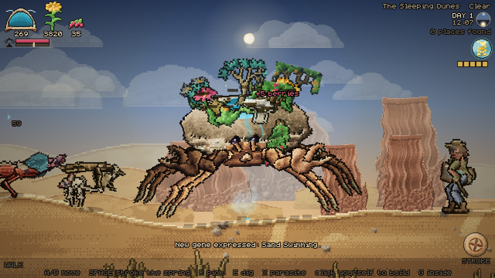

---

## Play it

**Single file, no install, no server.** Open `dist/crabden.html` in any
browser — including straight off the filesystem.

```
git clone https://github.com/PukkingDragon123/solid-fishstick
open solid-fishstick/dist/crabden.html
```

To run from source, or to rebuild the bundle after a change:

```
npm install       # esbuild only, used for the bundle
npm start         # http://localhost:8080
npm run build     # -> dist/crabden.html + dist/crabden.body.html
```

## Controls

|  | keyboard | touch |
| --- | --- | --- |
| scuttle | `A` / `D` or arrows | left thumbstick (drag anywhere in the lower-left) |
| the spring | tap `Space` in time with the gauge | tap the valve in time with the gauge |
| pick what is ripe | `R` | **PICK**, or tap the bead over a plant |
| build on your own back | click yourself | tap yourself |
| put a parasite on something | `X` | — |
| put a relic in your basin | `K` | — |
| tap out a word | hold/release `T` | — |
| Vess: follow, get on, get off | `F` | — |
| act — dig, win over, strike | `E` | **ACT** |
| map / fleet / field notes | `1` / `2` / `3` | **SHOP**, then a tab |
| inside you | `G` | tap the orb |
| control mode | `M` | **MODE** |
| zoom / pan | wheel, drag (locked while you are on your own back) | pinch, drag (same) |
| back out | `Esc` | the panel's X |

A crab does not turn round to walk — but it does turn round. Reverse direction
and the animal **pivots**: it goes edge-on, comes back out the other way, and
carries on sideways with the other shoulder leading. Everything on its back
turns with it.

The game autosaves every twenty seconds and reloads where you left off.

---

## The opening

The game does not start in the desert. It starts thirty metres under water,
because that is where the animal went to sleep.

`js/render/ocean.js` takes the screen for twenty seconds and is not the world
renderer at all: its own light, its own colour, its own physics. Kelp rooted on
the seabed rolls rather than wags, because each segment lags the one below it.
Three shoals hold formation around a moving centre and flash a flank as they
turn. God rays lean off the vertical and sway. Caustics crawl over the sand and
over the animal's back. Silt drifts up past you. And the crab — the real rig,
the same one you walk around in, with the red taken out of it by thirty metres
of water — comes down out of the blue, finds a hollow out of the current, and
**digs itself in**, throwing silt, until there is nothing left above the sand
but a ridge of shell.

Then the sea leaves. The waterline descends the screen over a thousand years
and eight seconds: the kelp above it browns and folds, the fish go with the
water, the sun burns through, the seabed above the line dries pale, and a
counter runs up to 1,000. The whole scene then **dissolves** into the desert
that has been drawn underneath it the entire time, so the mound you were
looking at and the animal you are about to play are in the same place on the
screen and are obviously the same thing.

And then it is this morning, and there is a woman who has been wrong about a
rock for eleven years, and the first water to touch this animal in a thousand
years is not, strictly, rain.

| | |
| --- | --- |
| 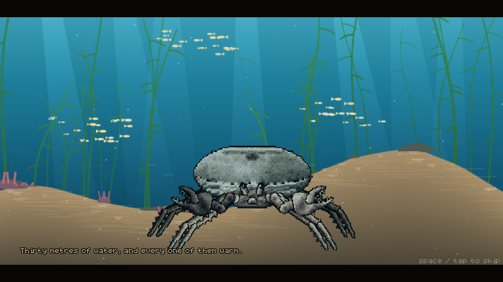 | 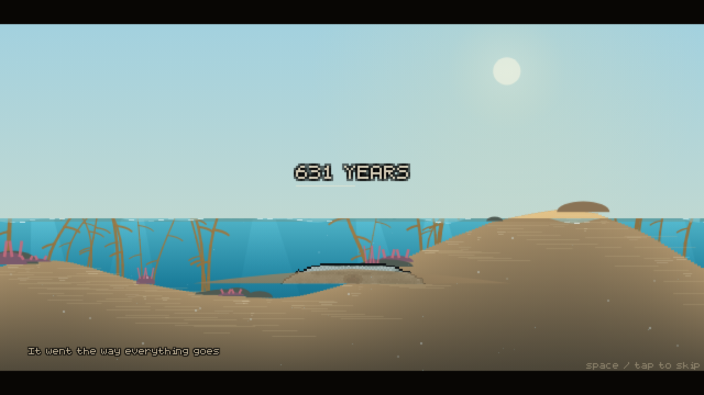 |

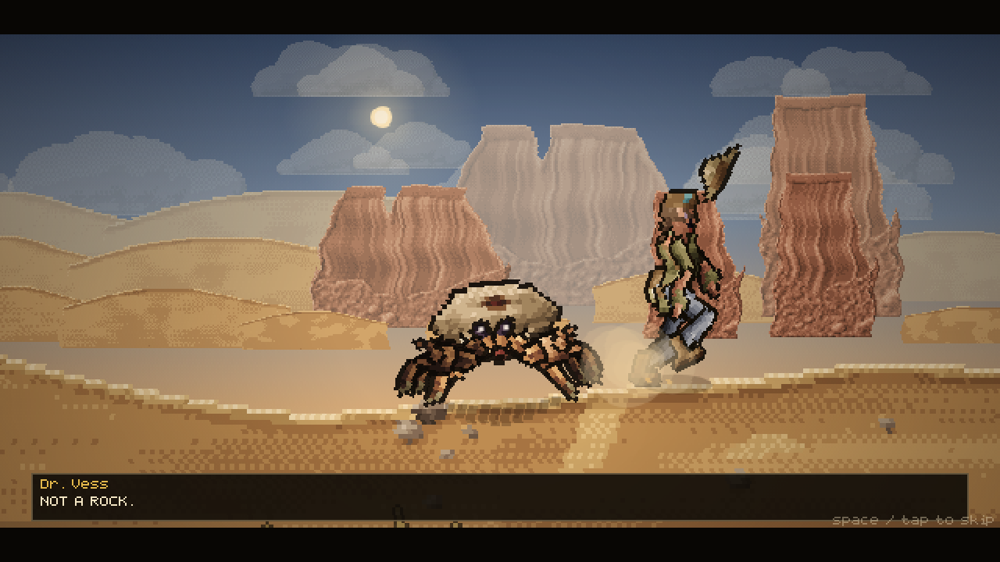

---

## The loop

**Water → plants → genes → evolution → more water — and the whole time, keep
walking, because the only thing out here worth having is over the next dune.**

1. **Pump.** The spring is a muscle with a rhythm, not a key you hold. A needle
   sweeps a bore and a band marks where the chamber is actually full: tap on
   the band and the stroke lands, tap on the middle of it and it lands
   perfectly, tap anywhere else and you have wasted a stroke. Land them in a
   row and the spring runs harder — and the band narrows, the needle speeds up,
   and past six in a row it **stutters**, reversing without warning, because
   the better you get the less margin you are given. Hammering does not work:
   a chamber has to refill between strokes, and a second push too soon breaks
   the chain. Water goes into the tank, then into the stone basin behind your
   crest, and when neither can take any more it comes over the lip and down your
   shell as a waterfall onto the sand you are standing on.
2. **Plant.** Click yourself to climb onto your own back, then **drag a seed
   out of the rail and drop it on a bed**. It goes in as a seed and does
   nothing at all until it has taken up water — the ring round it fills as the
   basin soaks it, and then it germinates. Seeds go anywhere on the shell;
   there is no slot count. What limits you is **balance**: everything you carry
   has a weight, you can only carry so much, and it matters which side you put
   it on. Overloaded, everything grows slower and you walk slower. Badly
   trimmed, you walk with a list and the heavy side starts to suffer.
3. **Pick.** Nothing on your back pays out on its own. A mature plant **ripens**
   on its own clock — and several of them will not ripen at all unless a
   condition holds: at dusk, after dark, in daylight, in the shade of something
   taller, with water in the basin, with something living on you. When it is
   ready a bead appears over it. Take it and it pays. A mature plant also
   expresses a **gene**, and genes are not purchasable: the only way to hold one
   is to be carrying something alive that expresses it.
4. **Attract.** Every species scores your shell — which genes it expresses,
   how lush it is, whether there is standing water — and only makes the walk
   when the score is worth it. Get close, offer fruit and water, and it joins
   your fleet and starts working.
5. **Evolve.** Evolutions cost nutrients *and* a specific set of genes. Growing
   from juvenile to adult to ancient makes the shell bigger, the basin deeper,
   and the garden on your back larger in every sense.

### Your genome

There is no skill menu. There is the animal, and you can look into it.

Press `G`, or tap the orb on your own back, and the camera does not stop at the
shell — it **dives**. You rush up at yourself out of the dark, a speck growing
into an animal filling the screen; then through the rock, the chitin and the
pearl, each layer named as it passes, the stars stretching into streaks, and out
the other side into the cavity where the thing that decides what you become is
sitting.

It is a skill tree, and it is built to the rules that make skill trees
readable rather than impressive:

- **Six arms, evenly spaced**, so a direction always means the same system and
  you learn where things are by where they are: FORM straight up, then SPRING,
  SHELL, BROOD, PINCER and LEGS around the clock.
- **Growth runs outward from a seed**, so how far a thing is from the middle is
  exactly how deep into that system you have gone. Each arm forks once and
  comes back together at a keystone, which is drawn bigger and ringed.
- **Nothing is drawn that you cannot reach.** You see what you own and what is
  one step past it, joined by a dashed lead, and a short stub where a chain
  continues. A wall of grey nodes you cannot buy teaches you nothing and makes
  the ones you can buy harder to find.
- **State is readable without reading.** Owned is lit and filled, closed by a
  ring with three lights running round it; affordable pulses; unaffordable
  carries an arc showing how much of its price you have saved so far. Rings at
  each tier and a filling bar beside every arm's name say how deep you are
  without you counting beads.
- **Every node carries a picture of what it does** — a drop, a moon, a saw, a
  spade, a crown — and exactly one effect that nothing else has. Words are for
  the hover card, which tells you what it is, what it costs, and precisely what
  is in the way if you cannot have it.
- **Buying one is an event**: the bead lights, sap runs out from the seed along
  every link it took to get there, two rings open out of the node with sparks
  thrown off them, the screen flares, and the organ at the end of that arm
  visibly grows.

Around the outside is the animal itself. Not a drawing of one: the crab. The
genome screen takes the very rig the desert crab is assembled from, poses it
standing and bakes it (`js/art/crabpose.js`) — the same carapace, the same eight
legs solved through the same IK, both claws, the eyestalks — then fills the
shape dark, lights its outline, and lays the full-colour render back inside it
as an x-ray, so the silhouette you grow your genome inside is the silhouette you
walk around in, joint for joint. It grows as you grow: a hatchling is a coin
with legs here too, and one sprite pixel is never blown up past a fixed size, so
evolving is visible on this screen as well as out in the sand. The basin on its
back holds however much water is actually in it.

Behind all of it is a galaxy, painted once from a bulge, two logarithmic arms
scattered star by star with pink nurseries strung along them and dust lanes
eating their inside edges, then turned very slowly while four layers of near
stars slide across it. Round the seed is a ring of **genes**, which are the one
thing you cannot buy: they light up only while something alive on your back is
expressing them.

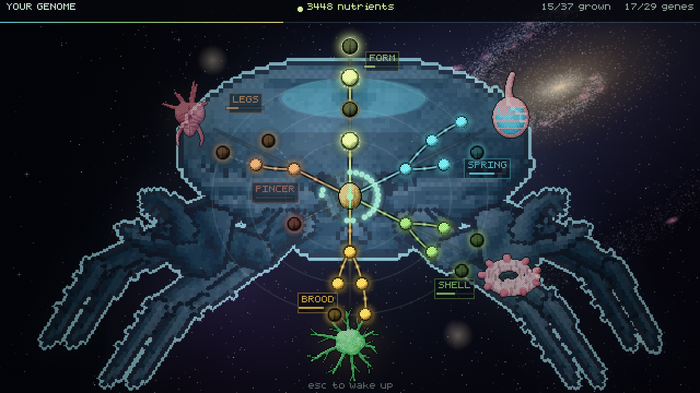

### Three ways to move

**WALK** — you steer. **ROAM** — the crab walks itself toward whatever is over
the next dune, and you watch. **FLEET** — click one of your own and click where
to send it. The last two unlock in the tree.

### Build mode

There is no shop and there is no build button. **Click the animal** and the
camera comes in on the shell, the seeds come out down the side, and you are up
on your own back — which is where planting something on your own back ought to
happen. **Nothing moves while you are up there.** Not you: it is your shell,
you are standing on it, and the legs are not available. Not the view either —
the camera is nailed to the shell, so a drag is a drag on a plant and a pinch
is not a way to lose the thing you were placing. The spring is shut too; you
are not running anything from up there.

The rail shows what you can carry, what you are carrying, and a grid of seeds
and structures. Pick one and the card at the bottom says what it costs, **what
it pays and how often**, what condition it needs before it will ripen, and what
it weighs. Press place, and every legal bed on the shell pulses, a ghost
follows the nearest one, and a bracket marks where it lands.

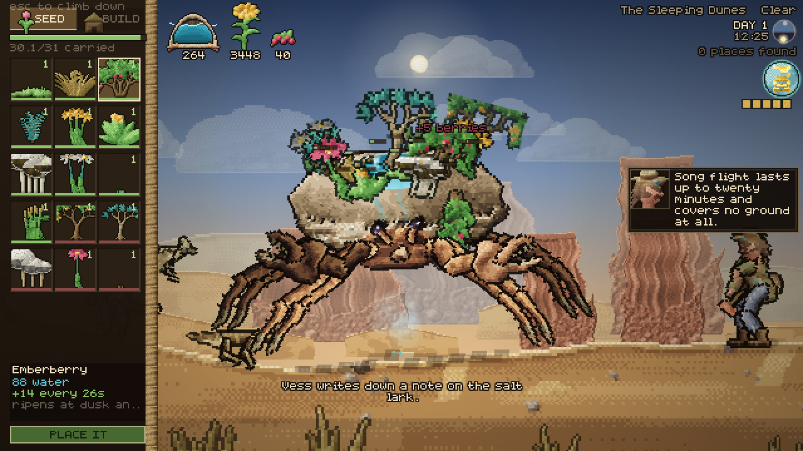

### Your fleet, and the parasites

Everything living on you has a card in the **FLEET** panel: what it is, what it
does, how far off it has wandered. Click one and the camera goes to it and the
movement keys become *its* movement keys, until you let go.

Some of them did not volunteer. A **mindcap** fruits parasites instead of food —
things that are almost animals, which hatch looking for a nervous system and
find yours already occupied. Press `X` next to a wild animal and one goes in.
What it takes over, you steer, and a hostile thing stops being hostile the
moment one of your children is in its nerves.

Dr. Vess has opinions about this.

> You just put one of your own children inside a lizard. I am writing that down
> and then I am going to think about it for a long time.

### Bringing it back

The basin was a sea, and you were the reason it was a sea. So the most
interesting thing you can do with water is not drink it — it is **spill it**.

Water coming off your shell soaks into the ground and stays there. Keep a
stretch wet long enough and things come up in it on their own, and stay up, and
hold their own water after that. Walk far enough with the valve open and the
strip behind you is a different colour from the strip in front of you. Vess
notices.

> That is a plant. Nobody planted that.

An **oasis** is just this taken to its conclusion: ground that holds itself
green without you, with reeds standing in the water, ferns and berry on the
banks, and animals that only live where there is standing water.

### What is under the sand

Everything that ever lived here is still here, a metre down. Grow a **digging
claw** and fossil and amber start showing above the sand — a corner of shale, a
bead of amber catching the light from a long way off. Dig one up and it goes in
your pack.

Then put it in the pool on your own back (`K`) and keep the water up. Given
long enough in standing water, a thousand-year-old thing in a rock **hatches**,
and walks off your shell into a desert that has forgotten it.

> You are going to put a fossil in a puddle on your back and wait. And it is
> going to work, is it? It is, isn't it.

### Living and dying

Everything out here ages. Animals get old and die of it, and your own fleet
turns over — which is the point of **Brooding**, which lets what lives on you
breed on you and replace its own dead. When something of yours dies, Vess says
something about it, and the ground it lies in is richer tomorrow.

The clock in the corner is a real dial: the sun and the moon go round it, the
lit half of the day is light and the dark half is dark, and it counts the days.
Things come up out of the sand at night.

### The map

One long strip of the basin, because the world is one long strip of the basin:
the real terrain profile under a band of the country you are crossing, distance
ticks in metres from where you woke, and every landmark within reach — oases,
human ruins, bonefields, wind-cut spires, and the occasional hull sitting
kilometres from any sea. Somewhere you have not stood is a `?`.

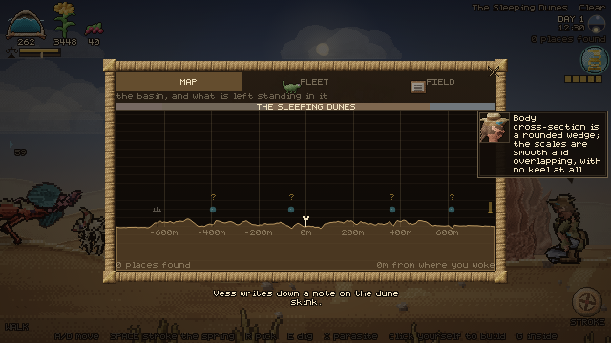

---

## What is out there

Seven biomes run for forty thousand strides: the Weeping Salt Pan, the Bone
Reef, the Sleeping Dunes, the Glass Flats, the Rustlands, the Ashwood and the
Deep Well. Each has its own sky, ground, rock and residents.

**Landmarks** are the point of walking. They are generated from the world seed
and sunk into the terrain itself, so an oasis is a real bowl you walk down into
with water standing in it, not a decal — and it is exactly where you left it
tomorrow. Oases, ruined shore towns, bone fields where a herd died on the way
somewhere better, and wind-cut spires. Each one has a name, and a chevron at
the edge of the screen points at the nearest one you have not stood in.

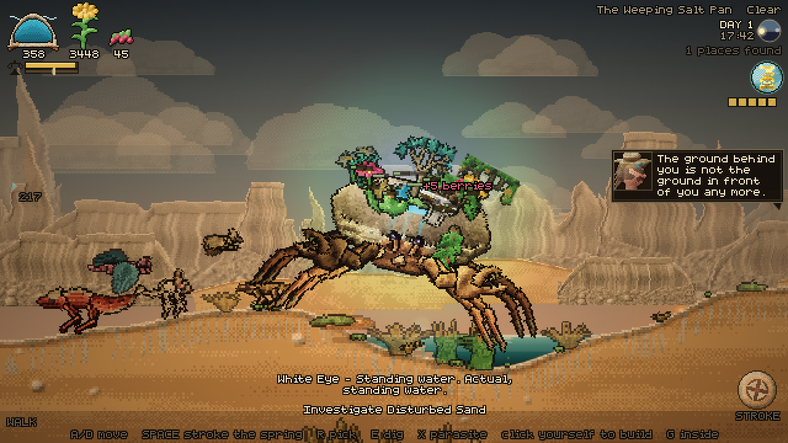

Smaller finds sit between them: buried relics, wild seed patches, water seeps,
old kills, nests — and disturbed sand, which is not a find so much as a warning
you probably will not read in time.

### The bestiary

Nearly everything alive here is a reptile or an arthropod, because those are
what a drying world leaves: a waterproof skin and a way of excreting waste
without spending water on it. Nine reptiles, nine bugs and arachnids, four
furred survivors that never drink, three birds.

You do not read their entries. You **watch** them, and Dr. Vess writes them
down — five field notes per species, unlocked by observation, spoken aloud as
she works them out. Real behaviour: the skink dives into a dune rather than
running across it, the pebbler's spines comb dew into its own mouth, the digger
wasp restarts its entire sequence if you move the prey a few centimetres.

And they are **her** notes, in her notebook, in her hands. If she is not with
you, the field-notes tab tells you how far away she is and which way. That is
the point of keeping her: `F` calls her over, and once you are big enough to
take her weight she rides the near rim of your shell and writes while you walk.

Hostiles do not bother a bare rock. Once you are carrying something worth
taking they start arriving, faster at night: dune scorpions in pairs, a bone
centipede with twenty-two pairs of legs all going the same way, a pale serpent
that is already where you are going, and a stone basilisk that is not hunting
you — it is checking whether you are new.

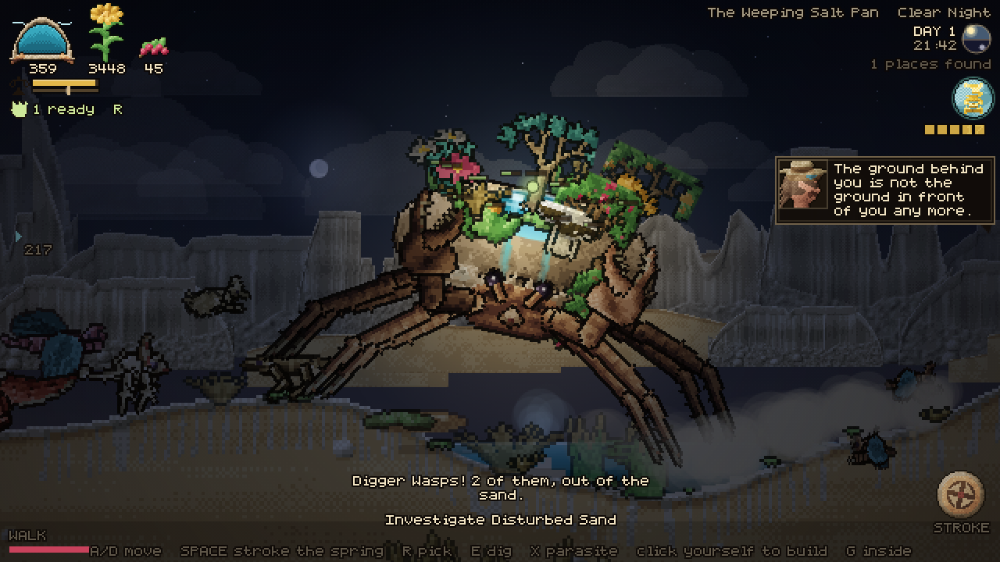

### What actually happened here

This was a shallow shelf sea. It did not dry up because of a catastrophe. It
dried up because the artesian system that filled it ran through the body of one
very large animal, and that animal went to sleep. Eleven shore towns cut their
cisterns facing the water, moved twice, and stopped. The lore is found rather
than given: fragments come off ruins one at a time, and Vess assembles the rest
as you find places.

---

## How it is built

No engine, no framework, no dependencies at runtime, and **no asset files at
all**. Every pixel in the game is generated in the browser when it starts.

### The painter

`js/render/pixel.js` is the reason the art looks the way it does. Sprites are
not drawn with strokes and fills — each one is built as a set of fields
(coverage, height, material, tint) and then *shaded*:

- surface normals come from the gradient of the height field
- lighting is lambert + rim + a cavity term (local height minus blurred height)
  + specular + subsurface translucency for leaves and membranes
- the result is quantised onto a per-material eight-colour ramp with 8×8 Bayer
  ordered dithering, then given a dark outline

`js/lib/palette.js` holds about forty materials — chitin, shell rock, claw,
leaf, moss, petal, berry, sand, bone, rust, water, fur, feather, scale,
carapace, membrane, horn, rope, cloth, metal, glass, skin, khaki, leather — so
a fern frond and a crab's leg are lit by the same sun and sit in the same
desert. Everything is baked once into a canvas at load.

### The crab

The crab is drawn **head-on**, because that is how a crab moves: it does not
turn to walk, it faces you and goes sideways underneath itself. The camera sits
a little above the animal, so the top of the shell is a real foreshortened
surface rather than a silhouette. `shellSurface(a, b)` in `js/art/crabart.js`
is the single source of truth for that surface — the art is painted from it and
the garden is planted on it, so a plant can never float off the rock.

The carapace is stamped as a height field over that surface and the shell wall
is then hung off the lowest pixel of each column of the result, which is what
makes the whole thing read as one solid animal instead of a rock with legs.
On it: horizontal bedding like the mesas it slept among, eroded shelves,
fracture lines, desert varnish streaking down the flank, crest spikes, fossil
barnacles, and a real stone basin behind the crest for the spring to fill.
The face is a chitin plate set into the front wall with two shallow orbits in
it, and the eyes are small hard black beads on short stalks with one live
specular dot — crabs do not have big expressive eyes, and pretending otherwise
makes them look like a toy.

You start as a **hatchling**: a coin with legs, about a quarter the width of
the adult, whose shell is rounder and whose legs are stubbier. Every number in
`crabMetrics()` interpolates on one growth parameter, so growing up is the same
animal at a different age rather than a different sprite.

`js/entities/crab.js` walks it. Nothing is a sprite animation: each leg keeps a
planted foot in world space, takes a step when the body has carried it too far,
and every joint is solved with two-bone IK — so a leg on a dune slope and a leg
in a hollow bend differently on the same frame. Each foot wants to be well
outboard of its own socket, so the legs splay the way a crab's do — knees up
and out, feet planted wider than the shell — and the four back legs contact
further away, which on screen puts them higher up and behind the body. The
body then rides on a line fitted through whichever feet are currently on the
ground, which is what makes it tilt going uphill, and rocks across its own gait
as it scuttles. The eye stalks track live, and the maxillipeds never stop.

### Plants and animals

Plants are grown, not drawn (`js/art/floraart.js`): a stem is traced, branches
split off it with a seeded angle, and leaves, petals and fruit hang on the
tips. The same generator runs at every growth stage and at any size, so a bush
you planted as a seed really is the same bush when it fruits, and a plant on an
ancient crab's shell is a bigger version of the same individual. The same
generator scatters the ground vegetation, thickening as you approach water.

Animals (`js/art/faunaart.js`) are a **body plan and a spine**, not a stack of
ellipses. The spine is a curve with a radius profile and the painter solves it
as a real tube, so a monitor lizard is long and low with a heavy tail root, a
beetle is three hard tagmata, a serpent is one smooth tube laid in an S, and a
jerboa is a deep chest on thin legs — all from twenty lines of description.
Skin is grown rather than noised: scales lie in rows that follow the spine, fur
is strands that break the silhouette, chitin gets plate seams and a tight
specular. Gaits follow the plan too — sprawlers throw their knees out and swing
the spine, insects walk an alternating tripod, reptiles bask.

### Dr. Vess

She is painted, not drawn. `js/art/personart.js` builds her the same way the
crab is built — height fields, material ramps, one light and a hard outline —
and hands back a **rig in pieces**: skull, jaw, ear, nose and one eye you can
read; hair tied back with strands pulling loose downwind; a felt hat with a
brim and a crown; goggles that sit on the band or come down over the eye; a
coat over a shirt, cut away down the front, with a bandolier of sample vials
and a belt; a satchel; four limb bones, and a boot that is its own part.

Because she is in pieces, she is **posed rather than flipped through**.
`js/entities/npc.js` is a skeleton: a pose is a set of joint targets — how far
she is folded, how far the spine leans, where each shoulder and elbow sits, and
what is in the near hand — and everything between poses is damped, so she never
snaps, she settles. Her feet are planted in world space and solved with the
same two-bone IK the crab's legs use, so she stands on slopes, tucks her feet
under her when she crouches over a dig, and swings a leg through rather than
sliding. The boot stays flat whatever the shin above it is doing.

The face is the same painter with a `mood` argument. An expression is four
numbers — how far the lid is down, how the brow is angled, how wide the mouth
opens, which way a closed mouth bows — plus two flags for a blush and a bead of
sweat. **Fourteen of them**: level, wry, alarmed, delighted, sour, asking,
proud, weary, shocked, laughing, thinking, stricken, grim, fond. They are baked
on demand, so she wears the right face in the world as well as in the bubble,
and the bubble's copy is painted at four times her walking scale.

She can also be **startled**, which is its own small piece of physics: she
leaves the ground, squashes on the way out and stretches at the top, tucks her
feet under her, lands with a thump and a puff of dust — and her hat comes off,
spins away on its own arc, bounces once and stays where it lands. Her kit — bedroll, canteen, lantern, survey peg, skull,
spoil heap, pick, brush — is painted the same way and scattered on the ground
wherever she sets up to dig.

Nothing in the game is a photograph of a sprite sheet any more, which is also
why the whole build is 40% smaller than it was.

She does three things now. On the ground she works — wanders, crouches, digs,
writes. **Follow** and she keeps pace behind you. **Get on** (once you are big
enough to take her weight) and she rides the near rim of your shell with her
notebook out, which is the only way she gets to write while you are moving. She
talks the whole time, in a bubble with a tail, about what she can see from up
there and about what you are carrying.

And she listens. You have no voice and no hands you can write with, so you
**tap** — hold `T` for a long tap, release for a short one, pause to end a
letter. Six taps in and she stops hearing noise and starts hearing language:

> Wait. Wait. That is not random. Long, short, long — that is code. You are
> TAPPING AT ME. You are a person. Oh, you are a person.

From then on you have a language. It is a terrible language. `WATER`, `HELP`,
`SEA`, `YES`, `NO`, `NAME`, `UP`, `DIG` — she answers every one of them, and
reads back anything else you spell letter by letter.

### The rest

- **Terrain** is a heightfield over X, baked into 256px chunks, with a live
  deformation map that footsteps push down and wind pulls back up.
- **Parallax** is three layers with real aerial perspective: each layer is
  painted into a scratch canvas and hazed toward the sky colour with
  `source-atop`, so distance desaturates the buttes without washing the sky.
- **Heat shimmer** blits the scene to the display in 2px horizontal bands with
  per-band sine offsets, strongest near the horizon. The UI is composited after
  it, so text never wobbles.
- **Weather** runs a real clock: clear, sandstorm, heatwave, rain, overcast and
  lightning, each with its own light colour, shadow length and haze.
- **Input** routes mouse, keyboard, multi-touch and the on-screen controls into
  the same virtual keys, so no gameplay code knows which one you used.
- **The HUD is not a HUD.** Water is a moulted shell with the water visibly in
  it; nutrients are a flower that opens as you bank them and drops a leaf when
  you spend; fruit is a sprig of fruit; your genome is an orb. All four are
  painted by the same height-field painter as the world, so the readouts are
  lit by the same sun as the desert behind them.

### Layout

```
js/
  art/       crabart crabpose personart floraart faunaart buildart anatomy
  core/      camera input save
  data/      flora fauna progress lore
  entities/  crab creature npc
  lib/       math font audio palette
  render/    pixel renderer backdrop
  systems/   garden economy wildlife encounters green digs talk pump fx
  ui/        ui icons tree
  world/     terrain biomes weather landmarks
```

---

## Screens

| | |
| --- | --- |
| 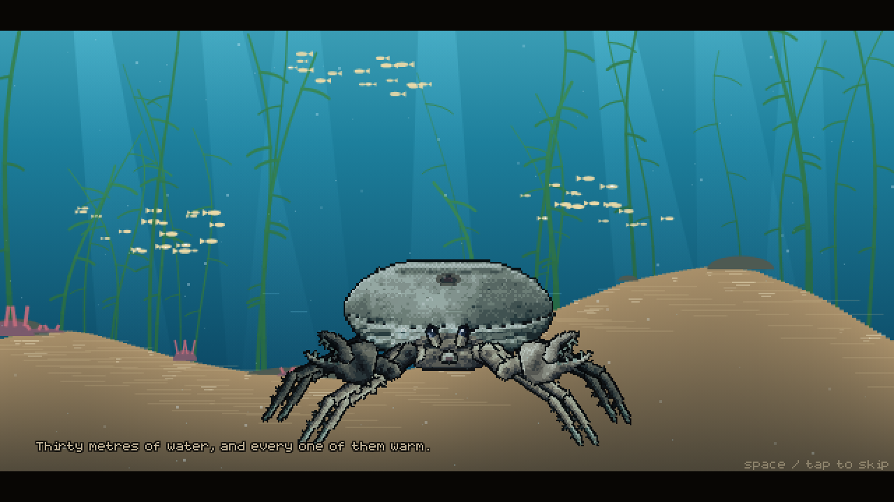 | 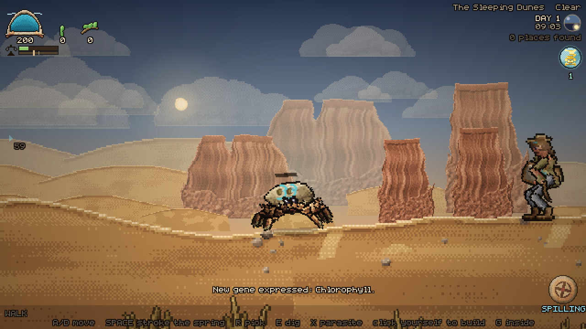 |
|  |  |
|  |  |
| 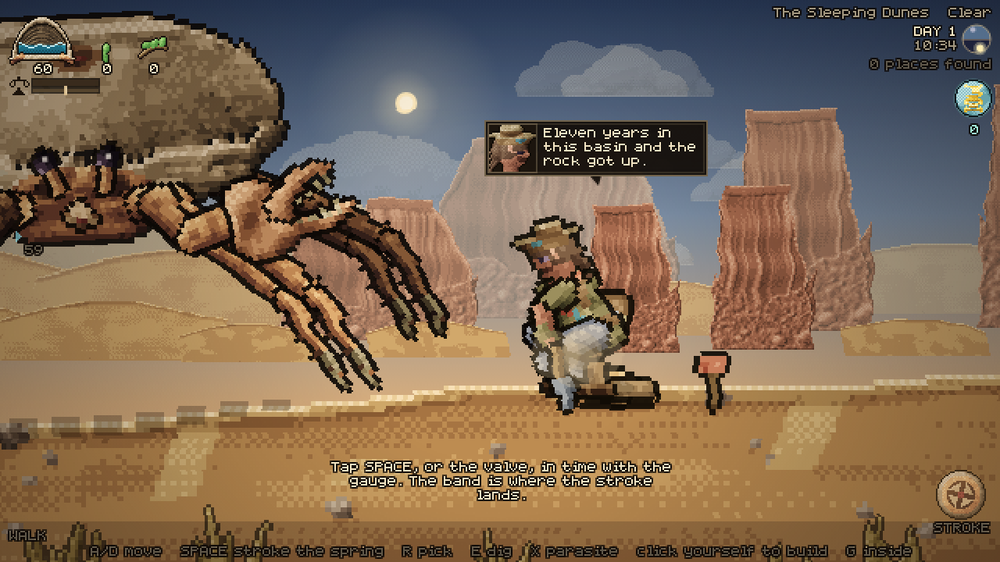 |  |

---

## Notes

Runs at 60fps from 320×200 up to 4K, on desktop and on a phone. Tested against
landscape phone, portrait phone and tablet profiles with real touch events.

On a narrow screen the HUD is a different layout rather than the same one
squeezed: the place name takes whatever room is left, the day count and the
"places found" line drop, the thumbstick grows and gets chevrons, and the
buttons lay themselves out along the bottom from the valve leftwards, wrapping
up a row rather than ever landing on the stick or on the spring — and a button
only exists when there is something to press. Up on your own back the rail owns
most of a phone screen, so the readouts collapse to one line, the stick and the
action buttons go away entirely, and the only thing left is **CLIMB DOWN**.
Save data lives in `localStorage` under `crabden.save.v1`; clearing it starts a
new run.

Everything in the game — every plant, every animal, the crab, Dr. Vess, the
terrain, the sky, the font and the sound — is generated at runtime from code.
There are no image files.
